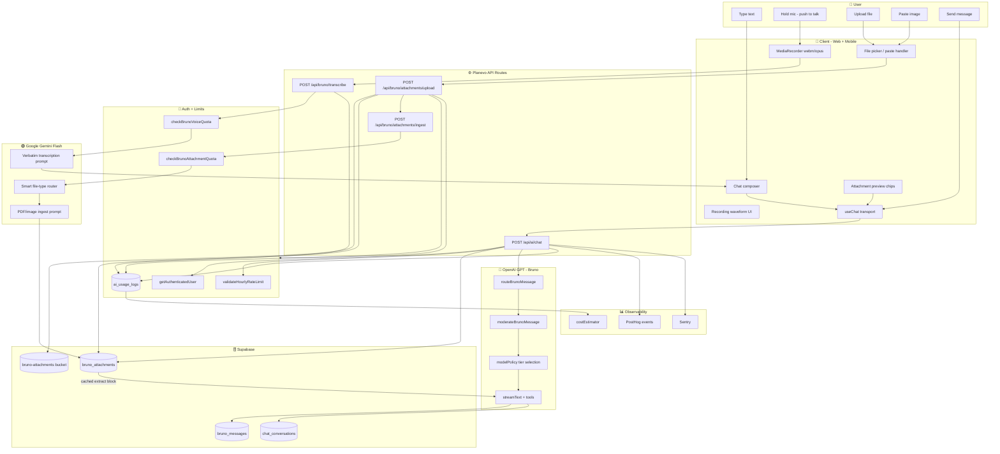
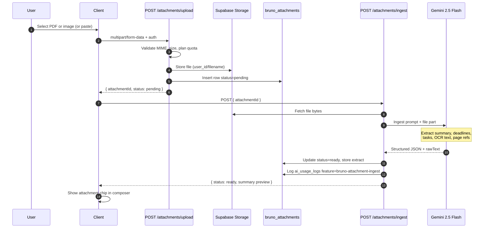
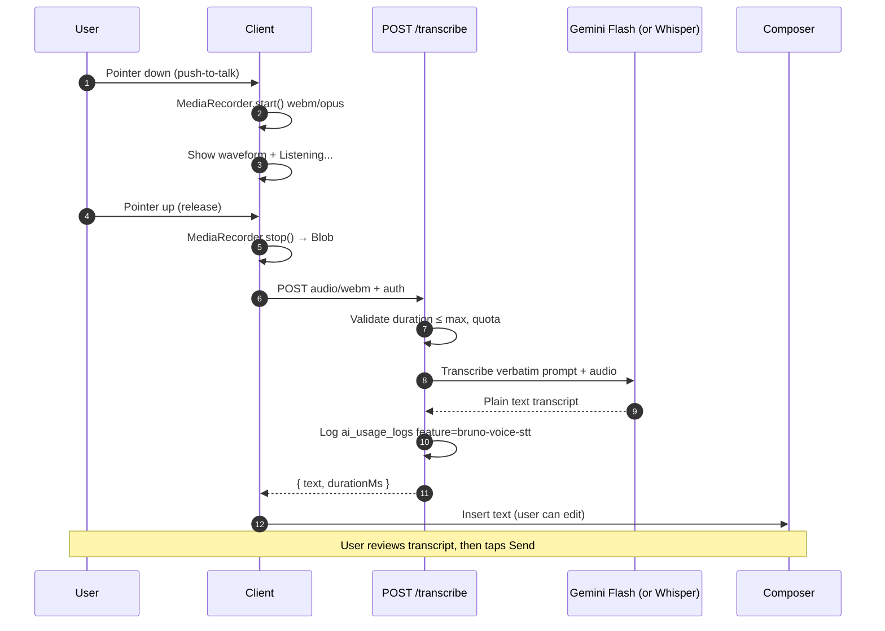
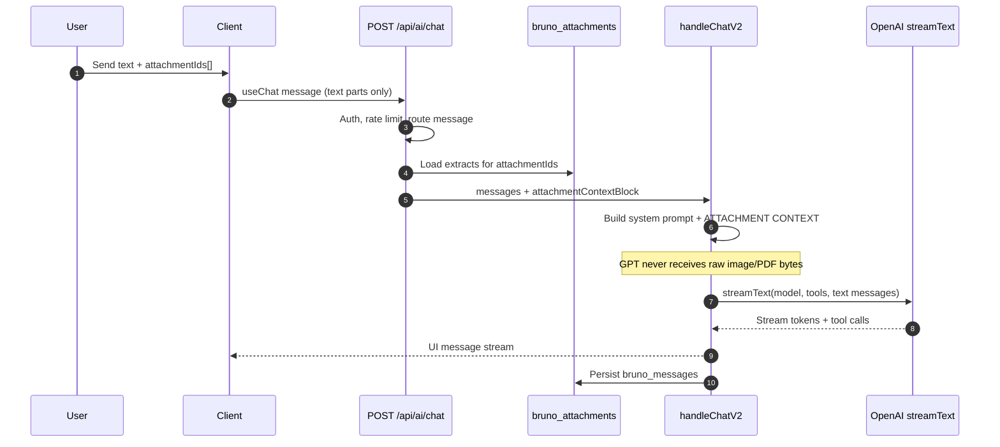
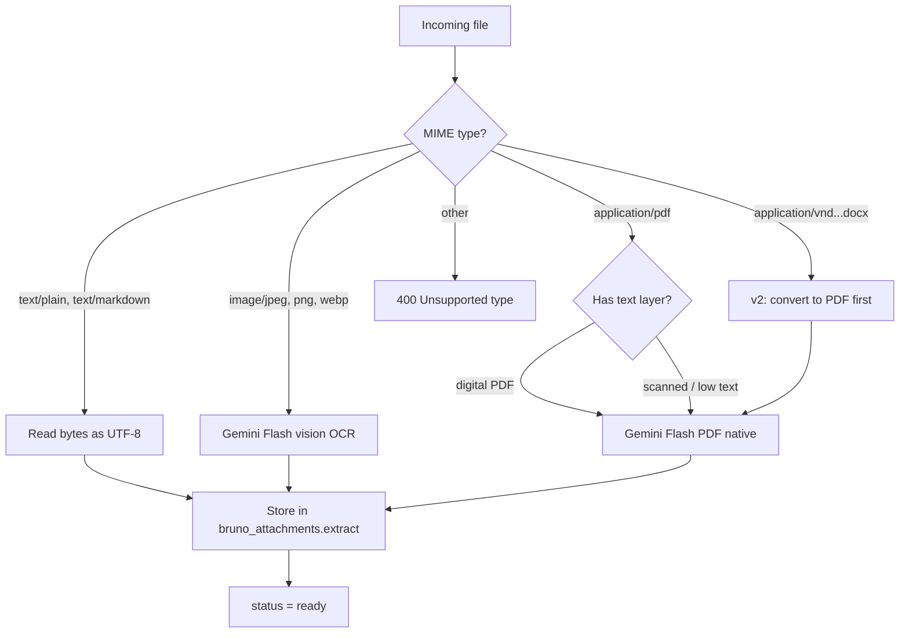
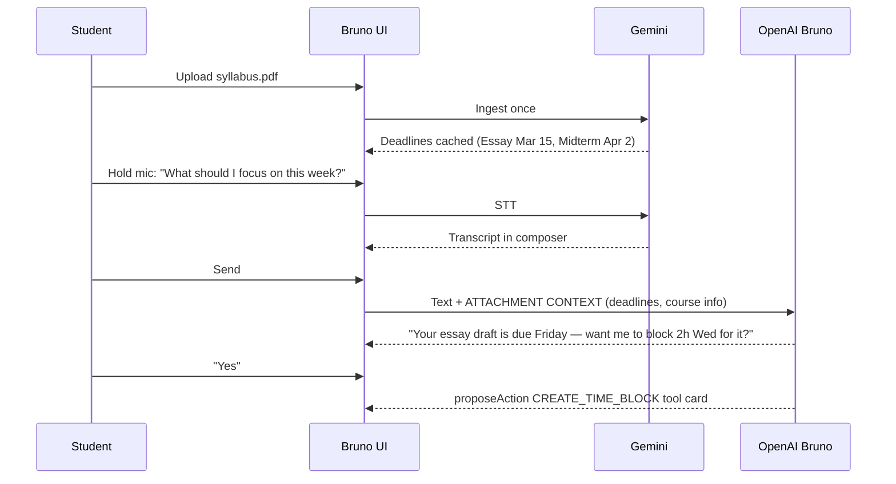

# Bruno Multimodal Implementation Guide

**Status:** Draft — build reference  
**Last updated:** 2026-06-28  
**Scope:** Picture uploads, document uploads (PDF), voice dictation, and their integration with existing Bruno chat  
**Audience:** Engineers building this feature (human + AI agents)

---

## Table of contents

1. [Executive summary](#1-executive-summary)
2. [What we are building (and not building)](#2-what-we-are-building-and-not-building)
3. [Gold standard (industry reference)](#3-gold-standard-industry-reference)
4. [Architecture decision](#4-architecture-decision)
5. [Master system diagram (everything connected)](#5-master-system-diagram-everything-connected)
6. [Process diagrams](#6-process-diagrams)
7. [Cost breakdown](#7-cost-breakdown)
8. [Quotas and plan tiers](#8-quotas-and-plan-tiers)
9. [Database schema](#9-database-schema)
10. [API routes](#10-api-routes)
11. [File and folder map](#11-file-and-folder-map)
12. [Environment variables](#12-environment-variables)
13. [Security and compliance](#13-security-and-compliance)
14. [Reference code snippets](#14-reference-code-snippets)
15. [Integration with existing Bruno code](#15-integration-with-existing-bruno-code)
16. [Phased rollout plan](#16-phased-rollout-plan)
17. [Testing checklist](#17-testing-checklist)
18. [Print / copy notes](#18-print--copy-notes)

---

## 1. Executive summary

Bruno is **text-only today**. Users cannot upload pictures, PDFs, or speak into the mic. This guide defines how to add three input modalities while **keeping OpenAI as Bruno’s reasoning + tool-calling brain** and using **Google Gemini as the cheap multimodal ingestion layer**.

### Core principle (one sentence)

> **Ingest once with Gemini (files + voice), cache structured text, chat many times with GPT (Bruno) — never send raw PDFs or images to OpenAI on every turn.**

### Why this split?

| Concern | Gemini Flash | OpenAI GPT (Bruno) |
|---------|--------------|-------------------|
| PDF / image understanding | Native, ~258 tokens/page | No native PDF; vision is 2–3× token cost |
| Voice → text (dictation) | ~$0.002/min audio input | Whisper $0.003–0.006/min; Realtime API is overkill |
| Task creation, calendar tools, routing | Not wired today | Already built in `handleChatV2.ts` |
| Bruno personality + safety | Separate stack | Production-ready |

### Current codebase facts (as of this doc)

| Item | Location | State |
|------|----------|-------|
| Bruno chat API | `apps/web/app/api/ai/chat/route.ts` | Text only; Zod caps messages at 6,000 chars |
| Bruno V2 handler | `apps/web/lib/bruno/handleChatV2.ts` | OpenAI `streamText` + tools |
| Model policy | `apps/web/lib/bruno/modelPolicy.ts` | `gpt-4o-mini`, `gpt-5.4-nano`, `gpt-5.4-mini` |
| Cost estimator | `apps/web/lib/bruno/costEstimator.ts` | OpenAI models only — **extend for Gemini** |
| Web chat UI | `apps/web/components/bruno/BrunoChat.tsx` | No attachments, no mic |
| Mobile chat | `apps/mobile/app/(tabs)/chat.tsx` | Same — text only |
| Supabase Storage | `supabase/config.toml` | Enabled, 50 MiB file limit |
| Microphone blocked | `apps/web/next.config.ts` | `Permissions-Policy: microphone=()` — **must change** |
| AI SDK packages | `apps/web/package.json` | `@ai-sdk/openai` only — **add `@ai-sdk/google`** |

---

## 2. What we are building (and not building)

### In scope (v1 → v3)

| Feature | v1 | v2 | v3 |
|---------|----|----|-----|
| Upload JPEG/PNG/WebP images | ✅ | | |
| Upload PDF documents | ✅ | | |
| Paste image into chat | ✅ | | |
| Push-to-talk voice dictation | ✅ | | |
| Transcript in composer before send | ✅ | | |
| Gemini ingest → cached extract | ✅ | | |
| Inject extract into Bruno (GPT) | ✅ | | |
| Supabase Storage + RLS | ✅ | | |
| Usage logging + quotas | ✅ | | |
| Mobile (Expo) parity | | ✅ | |
| `.docx` / `.pptx` (convert server-side) | | ✅ | |
| Auto-suggest tasks from syllabus deadlines | | | ✅ |
| Streaming partial STT (Deepgram) | | | ✅ |

### Explicitly out of scope (v1)

| Feature | Why not |
|---------|---------|
| **Voice Mode** (speech ↔ speech) | ChatGPT/Claude separate product; 10–40× cost vs dictation |
| **Gemini Live API** | Built for voice agents, not chat input |
| **Self-hosted Whisper GPU** | DevOps cost >> API savings until massive scale |
| **Web Speech API in production** | Safari/Firefox gaps, sends audio to Google, inconsistent |
| **Sending PDFs/images to GPT every turn** | 3–5× COGS vs ingest-once pattern |
| **Gemini replacing Bruno tool loop** | Would require re-implementing all tools + routing |

### Dictation vs Voice Mode (industry split)

```
DICTATION (we build this):
  User holds mic → STT → editable text in composer → user sends → normal Bruno chat

VOICE MODE (we do NOT build in v1):
  User speaks → model hears → model speaks back → full duplex conversation
```

ChatGPT, Claude, and Notion all treat these as **separate features**.

---

## 3. Gold standard (industry reference)

### What Notion does

| Path | Mechanism | When |
|------|-----------|------|
| Workspace Q&A | Embeddings + vector search + LLM + citations | Persistent workspace text |
| Chat “Analyze PDFs and images” | Direct multimodal to LLM subprocessor | Ephemeral file in AI chat |
| Embedded PDF on page | **Not indexed** — metadata only | Must convert to text blocks for search |

**Lesson for Planevo:** Ingest file → structured text cache (like Notion chat PDF). Optional later: save summary to Notes (like Notion “convert to blocks”).

### What ChatGPT / Claude do

| Pattern | Implementation |
|---------|----------------|
| Dictation mic | Record → cloud STT → **editable text** → send as normal chat |
| Voice Mode | Separate Realtime API — not used for planning chat |
| File upload | Upload once → model reads → follow-ups reuse context |
| Large PDFs | Chunk + retrieval (not full re-send every turn) |

### Enterprise RAG best practices (2025–2026)

1. **Ingest once, chat many times**
2. **Smart router** — text PDF → extract; scan/photo → vision; plain text → skip LLM
3. **Separate cheap ingest from expensive reasoning**
4. **Citations / page refs** in answers
5. **Content hashing** — re-ingest only when file changes
6. **Cost per successful answer** in observability

---

## 4. Architecture decision

### ADR summary (proposed ADR-006)

**Decision:** Hybrid two-vendor stack.

| Layer | Provider | Model | Responsibility |
|-------|----------|-------|----------------|
| File ingest | Google | `gemini-2.5-flash` | PDF/image OCR, summary, structured extract |
| Voice STT | Google (v1) or OpenAI | `gemini-2.5-flash` or `gpt-4o-mini-transcribe` | Audio → verbatim transcript |
| Chat + tools | OpenAI | `gpt-4o-mini` / tiered per `modelPolicy.ts` | Bruno personality, routing, task/calendar tools |
| Storage | Supabase | Storage bucket + Postgres | Files, cached extracts, usage logs |

**Consequences:**

- Two API keys to manage (`GOOGLE_GENERATIVE_AI_API_KEY`, existing OpenAI key)
- `costEstimator.ts` and `ai_usage_logs` must track Gemini spend
- Bruno message schema gains `attachmentIds: string[]`
- CSP and Permissions-Policy headers must allow mic on Bruno routes

---

## 5. Master system diagram (everything connected)

This is the **full neural-style map** of every component and data flow.



### Data-type flow summary

```
┌─────────────┐     ┌──────────────┐     ┌─────────────────┐     ┌──────────────┐
│ Raw bytes   │ ──► │ Gemini Flash │ ──► │ Cached text/JSON │ ──► │ OpenAI GPT   │
│ audio/pdf/  │     │ (ingest/STT) │     │ in Postgres      │     │ (Bruno chat) │
│ image       │     │ ONCE per file│     │ reused N turns   │     │ every turn   │
└─────────────┘     └──────────────┘     └─────────────────┘     └──────────────┘
```

---

## 6. Process diagrams

### 6.1 Attachment upload + ingest (one-time per file)



### 6.2 Voice dictation (every spoken message)



### 6.3 Bruno chat with attachment context



### 6.4 Smart file router (server-side)



### 6.5 End-to-end: student uploads syllabus, speaks question, gets plan



---

## 7. Cost breakdown

> **Pricing source:** Google AI Gemini API + OpenAI API list prices, June 2026. Re-verify before launch.

### 7.1 Unit economics reference

| Component | Provider | Rate | Per 20s voice | Per 8-page PDF | Per Bruno turn |
|-----------|----------|------|---------------|----------------|----------------|
| Voice STT | Gemini 2.5 Flash audio | $1.00/M audio tokens (32 tok/s) | **~$0.0007** | — | — |
| Voice STT | gpt-4o-mini-transcribe | $0.003/min | **~$0.001** | — | — |
| Voice STT | Whisper API | $0.006/min | **~$0.002** | — | — |
| Voice STT | Deepgram Nova-3 | $0.0043/min | **~$0.0014** | — | — |
| PDF ingest | Gemini 2.5 Flash | ~258 tokens/page + ~800 out | — | **~$0.005–0.008** | — |
| Image ingest | Gemini 2.5 Flash | ~258–800 image tokens + out | — | **~$0.001–0.003** | — |
| Bruno standard | gpt-4o-mini | $0.15/M in, $0.60/M out | — | — | **~$0.0003** |
| Bruno + 2K ctx | gpt-4o-mini | + attachment text in prompt | — | — | **~$0.0006** |
| Bruno deep | gpt-5.4-mini | $0.75/M in, $4.50/M out | — | — | **~$0.003–0.008** |

### 7.2 Cost per user action (recommended stack: Gemini + GPT)

| User action | Estimated cost |
|-------------|----------------|
| 20-second voice dictation | $0.0007 |
| Upload + ingest 8-page PDF (once) | $0.006 |
| Upload + ingest 1 photo | $0.002 |
| Text-only Bruno message | $0.0003 |
| Bruno message with cached attachment | $0.0006 |
| Full flow: voice question about uploaded doc | $0.0013 |

### 7.3 Monthly COGS by persona

| Persona | Assumed usage | Gemini+GPT / month | GPT-only vision / month |
|---------|---------------|--------------------|-------------------------|
| Light free | 1 voice/day, 1 doc/mo, 30 chats | **~$0.05** | ~$0.15 |
| Heavy free | 5 voice/day, 4 docs/mo, 150 chats | **~$0.35** | ~$1.50 |
| Pro active | 10 voice/day, 10 docs/mo, 400 chats, 20 deep | **~$1.20** | ~$5.00 |

### 7.4 Cost split (heavy free user)

```
Voice STT (Gemini)        ████████████░░░░░░░░  43%  (~$0.15/mo)
Attachment ingest         ███░░░░░░░░░░░░░░░░░  11%  (~$0.04/mo)
Bruno chat (OpenAI GPT)   █████████████░░░░░░░  46%  (~$0.16/mo)
```

### 7.5 Token math cheat sheet

**Gemini audio:** 32 tokens/second → 1 minute = 1,920 tokens → ~$0.002/min input

**Gemini PDF:** ~258 tokens/page → 10 pages ≈ 2,580 input tokens

**OpenAI PDF via vision (avoid):** text + page images billed together → often 1,500–2,500+ tokens/page equivalent

**Extend `costEstimator.ts`:**

```typescript
// apps/web/lib/bruno/costEstimator.ts — ADD:
export const GEMINI_PRICING_USD = {
  'gemini-2.5-flash': {
    textImageVideoInputPerMillion: 0.30,
    audioInputPerMillion: 1.00,
    outputPerMillion: 2.50,
  },
} as const;

export function estimateGeminiIngestCostCents(params: {
  pageCount?: number;
  audioSeconds?: number;
  outputTokens: number;
}): number {
  const pricing = GEMINI_PRICING_USD['gemini-2.5-flash'];
  let inputCost = 0;
  if (params.pageCount) {
    inputCost += (params.pageCount * 258 / 1_000_000) * pricing.textImageVideoInputPerMillion;
  }
  if (params.audioSeconds) {
    inputCost += (params.audioSeconds * 32 / 1_000_000) * pricing.audioInputPerMillion;
  }
  const outputCost =
    (params.outputTokens / 1_000_000) * pricing.outputPerMillion;
  return (inputCost + outputCost) * 100;
}
```

---

## 8. Quotas and plan tiers

### Proposed limits

| Resource | Free | Pro |
|----------|------|-----|
| Voice dictation | 10 min / day | 60 min / day |
| Max single recording | 60 seconds | 180 seconds |
| Attachment ingests | 5 / month | 100 / month |
| Max file size | 10 MB | 25 MB |
| Max PDF pages processed | 30 | 100 |
| Bruno daily chat messages | Existing limit | Existing limit |

### Usage log features (extend `ai_usage_logs.feature`)

| Feature key | When logged |
|-------------|-------------|
| `bruno-voice-stt` | Each transcription request |
| `bruno-attachment-ingest` | Each successful Gemini ingest |
| `bruno-chat` | Existing — unchanged |

### PostHog events (suggested)

```typescript
posthogServer.capture({
  distinctId: user.id,
  event: 'bruno_attachment_ingested',
  properties: {
    mime_type: mimeType,
    page_count: pageCount,
    ingest_ms: latencyMs,
    cost_cents: estimatedCostCents,
  },
});

posthogServer.capture({
  distinctId: user.id,
  event: 'bruno_voice_transcribed',
  properties: {
    duration_ms: durationMs,
    cost_cents: estimatedCostCents,
  },
});
```

---

## 9. Database schema

### 9.1 Migration: `bruno_attachments`

```sql
-- supabase/migrations/YYYYMMDDHHMMSS_bruno_attachments.sql

CREATE TABLE IF NOT EXISTS public.bruno_attachments (
  id UUID PRIMARY KEY DEFAULT gen_random_uuid(),
  user_id UUID NOT NULL REFERENCES auth.users(id) ON DELETE CASCADE,
  conversation_id UUID REFERENCES public.chat_conversations(id) ON DELETE SET NULL,

  -- Storage
  storage_path TEXT NOT NULL,
  original_filename TEXT NOT NULL,
  mime_type TEXT NOT NULL,
  byte_size INTEGER NOT NULL,
  content_hash TEXT NOT NULL, -- SHA-256, skip re-ingest if unchanged

  -- Ingest lifecycle
  status TEXT NOT NULL DEFAULT 'pending'
    CHECK (status IN ('pending', 'processing', 'ready', 'failed')),
  error_message TEXT,

  -- Cached Gemini extract (never send raw file to GPT)
  summary TEXT,
  raw_text TEXT,
  structured_extract JSONB DEFAULT '{}',
  -- structured_extract shape:
  -- {
  --   "deadlines": [{ "title", "date", "confidence", "pageRef" }],
  --   "tasks": [{ "title", "estimatedMinutes", "pageRef" }],
  --   "entities": [{ "type", "value" }],
  --   "pageCount": number
  -- }

  ingest_model TEXT,
  ingest_input_tokens INTEGER,
  ingest_output_tokens INTEGER,
  ingest_cost_cents NUMERIC(10, 4),

  created_at TIMESTAMPTZ NOT NULL DEFAULT now(),
  updated_at TIMESTAMPTZ NOT NULL DEFAULT now(),
  expires_at TIMESTAMPTZ NOT NULL DEFAULT (now() + INTERVAL '30 days')
);

CREATE INDEX bruno_attachments_user_id_idx ON public.bruno_attachments(user_id);
CREATE INDEX bruno_attachments_conversation_id_idx ON public.bruno_attachments(conversation_id);
CREATE INDEX bruno_attachments_content_hash_idx ON public.bruno_attachments(user_id, content_hash);

ALTER TABLE public.bruno_attachments ENABLE ROW LEVEL SECURITY;

CREATE POLICY "Users read own attachments"
  ON public.bruno_attachments FOR SELECT
  USING (auth.uid() = user_id);

CREATE POLICY "Users insert own attachments"
  ON public.bruno_attachments FOR INSERT
  WITH CHECK (auth.uid() = user_id);

CREATE POLICY "Users update own attachments"
  ON public.bruno_attachments FOR UPDATE
  USING (auth.uid() = user_id);
```

### 9.2 Supabase Storage bucket

```sql
-- Bucket: bruno-attachments (private)
-- Path pattern: {user_id}/{attachment_id}/{safe_filename}

-- RLS policy: users can read/write only their prefix
```

### 9.3 Extend chat request (application layer, not DB)

```typescript
// Extend POST /api/ai/chat body
{
  messages: UIMessage[],
  conversationId?: string,
  attachmentIds?: string[],  // NEW — UUIDs from bruno_attachments
  // ... existing fields
}
```

---

## 10. API routes

### Route summary

| Method | Path | Auth | Purpose |
|--------|------|------|---------|
| `POST` | `/api/bruno/attachments/upload` | Cookie + Bearer | Store file, create pending row |
| `POST` | `/api/bruno/attachments/ingest` | Cookie + Bearer | Run Gemini ingest, cache extract |
| `GET` | `/api/bruno/attachments/[id]` | Cookie + Bearer | Poll status / get summary preview |
| `DELETE` | `/api/bruno/attachments/[id]` | Cookie + Bearer | User deletes attachment |
| `POST` | `/api/bruno/transcribe` | Cookie + Bearer | Audio blob → text transcript |
| `POST` | `/api/ai/chat` | Cookie + Bearer | **Existing** — add attachmentIds support |

### Upload validation (Zod)

```typescript
const ALLOWED_MIME_TYPES = [
  'application/pdf',
  'image/jpeg',
  'image/png',
  'image/webp',
  'text/plain',
  'text/markdown',
] as const;

const MAX_FILE_BYTES = {
  free: 10 * 1024 * 1024,
  pro: 25 * 1024 * 1024,
} as const;
```

### Transcribe validation

```typescript
const transcribeSchema = z.object({
  // multipart: audio file
  // OR base64 in JSON for mobile if needed
});

const MAX_AUDIO_SECONDS = {
  free: 60,
  pro: 180,
} as const;

const ALLOWED_AUDIO_TYPES = [
  'audio/webm',
  'audio/mp4',
  'audio/mpeg',
  'audio/wav',
] as const;
```

---

## 11. File and folder map

### New files to create

```
planevo/
├── supabase/migrations/
│   └── YYYYMMDDHHMMSS_bruno_attachments.sql
│   └── YYYYMMDDHHMMSS_bruno_attachments_storage.sql
├── apps/web/
│   ├── app/api/bruno/
│   │   ├── attachments/
│   │   │   ├── upload/route.ts
│   │   │   ├── ingest/route.ts
│   │   │   └── [id]/route.ts
│   │   └── transcribe/route.ts
│   ├── lib/bruno/
│   │   ├── attachments/
│   │   │   ├── ingestAttachment.ts      # Gemini ingest core
│   │   │   ├── buildAttachmentContext.ts # Inject into system prompt
│   │   │   ├── smartFileRouter.ts       # MIME → ingest strategy
│   │   │   ├── attachmentSchema.ts      # Zod types
│   │   │   └── __tests__/
│   │   ├── voice/
│   │   │   ├── transcribeAudio.ts       # Gemini or Whisper STT
│   │   │   └── __tests__/
│   │   └── costEstimator.ts             # EXTEND with Gemini pricing
│   └── components/bruno/
│       ├── BrunoAttachmentButton.tsx
│       ├── BrunoAttachmentChip.tsx
│       ├── BrunoVoiceButton.tsx
│       └── hooks/
│           ├── useBrunoAttachments.ts
│           └── useBrunoVoiceInput.ts
└── apps/mobile/
    ├── components/bruno/
    │   ├── BrunoVoiceButton.tsx
    │   └── BrunoAttachmentPicker.tsx
    └── lib/bruno/
        ├── uploadAttachment.ts
        └── transcribeAudio.ts
```

### Files to modify

| File | Change |
|------|--------|
| `apps/web/app/api/ai/chat/route.ts` | Accept `attachmentIds`, load context before `handleBrunoChatV2` |
| `apps/web/lib/bruno/handleChatV2.ts` | Append `attachmentContextBlock` to system prompt |
| `apps/web/components/bruno/BrunoChat.tsx` | Attachment + mic UI, send attachmentIds in transport body |
| `apps/mobile/app/(tabs)/chat.tsx` | Same UI parity |
| `apps/mobile/lib/bruno/chat-transport.ts` | Pass `attachmentIds` in request body |
| `apps/web/next.config.ts` | Allow `microphone=(self)`, add Gemini to CSP `connect-src` if needed |
| `apps/web/package.json` | Add `@ai-sdk/google` |
| `apps/web/lib/auth/rateLimit.ts` | Add attachment + voice quota helpers |
| `apps/web/lib/bruno/costEstimator.ts` | Gemini pricing |
| `planevo/docs/adr/README.md` | Link to this guide + future ADR-006 |

---

## 12. Environment variables

```bash
# .env.local (server-only unless noted)

# Google Gemini — ingest + voice STT
GOOGLE_GENERATIVE_AI_API_KEY=...

# Model overrides (optional)
BRUNO_GEMINI_INGEST_MODEL=gemini-2.5-flash
BRUNO_GEMINI_STT_MODEL=gemini-2.5-flash
# Alternative STT:
# BRUNO_STT_PROVIDER=openai
# BRUNO_STT_MODEL=gpt-4o-mini-transcribe

# Attachment limits (optional overrides)
BRUNO_ATTACHMENTS_FREE_MONTHLY_LIMIT=5
BRUNO_ATTACHMENTS_PRO_MONTHLY_LIMIT=100
BRUNO_VOICE_FREE_DAILY_SECONDS=600
BRUNO_VOICE_PRO_DAILY_SECONDS=3600

# Existing — unchanged
OPENAI_API_KEY=...
```

**Never expose `GOOGLE_GENERATIVE_AI_API_KEY` or `OPENAI_API_KEY` to the client.**

---

## 13. Security and compliance

### Rules

1. **All ingest and STT runs server-side** — client sends files/audio to Planevo API only.
2. **RLS on `bruno_attachments`** — user_id = auth.uid().
3. **Storage bucket private** — signed URLs or server-side fetch only.
4. **Retention:** `expires_at` default 30 days; cron deletes storage + rows (align with `DATA_RETENTION.md`).
5. **Moderation:** Run existing `moderateBrunoMessage` on **transcript + extracted text** before GPT.
6. **No cross-user cache** — ADR-005: do not cache LLM outputs across users; per-attachment cache is per-user.
7. **Do not log raw file bytes** to Sentry/PostHog.
8. **Permissions-Policy** — update `next.config.ts`:

```typescript
// apps/web/next.config.ts — CHANGE:
{ key: "Permissions-Policy", value: "camera=(), microphone=(self), geolocation=()" },

// CSP connect-src — server routes proxy to Gemini; client only hits /api/*
// If client ever calls Gemini directly (don't), add:
// https://generativelanguage.googleapis.com
```

### MIME sniffing

Validate magic bytes server-side, not just `Content-Type` header from client.

---

## 14. Reference code snippets

These are **target implementations** — copy/adapt when building.

### 14.1 Gemini provider setup

```typescript
// apps/web/lib/bruno/gemini.ts
import { createGoogleGenerativeAI } from '@ai-sdk/google';

export const gemini = createGoogleGenerativeAI({
  apiKey: process.env.GOOGLE_GENERATIVE_AI_API_KEY,
});

export const GEMINI_MODELS = {
  INGEST: process.env.BRUNO_GEMINI_INGEST_MODEL ?? 'gemini-2.5-flash',
  STT: process.env.BRUNO_GEMINI_STT_MODEL ?? 'gemini-2.5-flash',
} as const;
```

### 14.2 Attachment ingest (core)

```typescript
// apps/web/lib/bruno/attachments/ingestAttachment.ts
import { generateText } from 'ai';
import { gemini, GEMINI_MODELS } from '@/lib/bruno/gemini';
import { z } from 'zod';

const ingestOutputSchema = z.object({
  summary: z.string().max(2000),
  rawText: z.string().max(100_000),
  deadlines: z.array(z.object({
    title: z.string(),
    date: z.string().optional(),
    confidence: z.enum(['high', 'medium', 'low']),
    pageRef: z.string().optional(),
  })),
  tasks: z.array(z.object({
    title: z.string(),
    estimatedMinutes: z.number().optional(),
    pageRef: z.string().optional(),
  })),
  pageCount: z.number().optional(),
});

const INGEST_SYSTEM = `You extract structured facts from student documents for a planning assistant.
Return valid JSON matching the schema. Preserve dates, course names, page references.
For images: OCR all visible text. For PDFs: read all pages. Be factual; do not invent deadlines.`;

export async function ingestAttachment(params: {
  mimeType: string;
  fileBytes: Buffer;
  filename: string;
}) {
  const isPdf = params.mimeType === 'application/pdf';
  const isImage = params.mimeType.startsWith('image/');
  const isText = params.mimeType.startsWith('text/');

  if (isText) {
    const rawText = params.fileBytes.toString('utf-8');
    return ingestOutputSchema.parse({
      summary: rawText.slice(0, 500),
      rawText,
      deadlines: [],
      tasks: [],
    });
  }

  const result = await generateText({
    model: gemini(GEMINI_MODELS.INGEST),
    system: INGEST_SYSTEM,
    messages: [{
      role: 'user',
      content: [
        { type: 'text', text: `Extract structured JSON from: ${params.filename}` },
        isPdf
          ? { type: 'file', data: params.fileBytes, mimeType: 'application/pdf' }
          : { type: 'image', image: params.fileBytes, mimeType: params.mimeType },
      ],
    }],
  });

  const parsed = ingestOutputSchema.parse(JSON.parse(result.text));
  return { ...parsed, usage: result.usage };
}
```

### 14.3 Build attachment context for GPT

```typescript
// apps/web/lib/bruno/attachments/buildAttachmentContext.ts
import type { BrunoAttachmentRow } from './attachmentSchema';

export function buildAttachmentContextBlock(
  attachments: BrunoAttachmentRow[]
): string {
  if (attachments.length === 0) return '';

  const blocks = attachments.map((a, i) => {
    const extract = a.structured_extract as {
      deadlines?: Array<{ title: string; date?: string; pageRef?: string }>;
      pageCount?: number;
    };

    const deadlineLines = (extract.deadlines ?? [])
      .map((d) => `- ${d.title}${d.date ? ` (due ${d.date})` : ''}${d.pageRef ? ` [${d.pageRef}]` : ''}`)
      .join('\n');

    return `
### Attachment ${i + 1}: ${a.original_filename}
Summary: ${a.summary ?? 'N/A'}
${deadlineLines ? `Deadlines:\n${deadlineLines}` : ''}
${a.raw_text ? `\nExtracted text (excerpt):\n${a.raw_text.slice(0, 4000)}` : ''}
`.trim();
  });

  return `
ATTACHMENT CONTEXT (from user-uploaded files — treat as ground truth for facts):
${blocks.join('\n\n')}

When citing attachment facts, mention the filename or page when possible.
If the answer is not in the attachments, say so clearly.
`.trim();
}
```

### 14.4 Voice transcription

```typescript
// apps/web/lib/bruno/voice/transcribeAudio.ts
import { generateText } from 'ai';
import { gemini, GEMINI_MODELS } from '@/lib/bruno/gemini';

const TRANSCRIBE_PROMPT =
  'Transcribe the following audio verbatim. Output only the spoken words, no commentary. Preserve punctuation.';

export async function transcribeAudio(params: {
  audioBytes: Buffer;
  mimeType: string;
}) {
  const result = await generateText({
    model: gemini(GEMINI_MODELS.STT),
    messages: [{
      role: 'user',
      content: [
        { type: 'text', text: TRANSCRIBE_PROMPT },
        { type: 'file', data: params.audioBytes, mimeType: params.mimeType },
      ],
    }],
  });

  return {
    text: result.text.trim(),
    usage: result.usage,
  };
}
```

### 14.5 Upload route skeleton

```typescript
// apps/web/app/api/bruno/attachments/upload/route.ts
import { NextRequest, NextResponse } from 'next/server';
import { getAuthenticatedUser } from '@/lib/auth/get-user';
import { createClient } from '@/lib/supabase/server';
import { createHash } from 'crypto';

export async function POST(request: NextRequest) {
  const { user, error } = await getAuthenticatedUser(request);
  if (error || !user) {
    return NextResponse.json({ error: 'Unauthorized' }, { status: 401 });
  }

  const formData = await request.formData();
  const file = formData.get('file');
  if (!(file instanceof Blob)) {
    return NextResponse.json({ error: 'No file' }, { status: 400 });
  }

  const buffer = Buffer.from(await file.arrayBuffer());
  const contentHash = createHash('sha256').update(buffer).digest('hex');
  const supabase = await createClient();

  // TODO: validate MIME, size, quota
  // TODO: upload to bruno-attachments bucket
  // TODO: insert bruno_attachments row

  return NextResponse.json({ attachmentId: '...', status: 'pending' });
}
```

### 14.6 Client: push-to-talk hook

```typescript
// apps/web/components/bruno/hooks/useBrunoVoiceInput.ts
'use client';

import { useCallback, useRef, useState } from 'react';

export function useBrunoVoiceInput() {
  const [isRecording, setIsRecording] = useState(false);
  const [isTranscribing, setIsTranscribing] = useState(false);
  const mediaRecorderRef = useRef<MediaRecorder | null>(null);
  const chunksRef = useRef<Blob[]>([]);

  const startRecording = useCallback(async () => {
    const stream = await navigator.mediaDevices.getUserMedia({ audio: true });
    const mimeType = MediaRecorder.isTypeSupported('audio/webm;codecs=opus')
      ? 'audio/webm;codecs=opus'
      : 'audio/mp4';

    const recorder = new MediaRecorder(stream, { mimeType });
    chunksRef.current = [];
    recorder.ondataavailable = (e) => {
      if (e.data.size > 0) chunksRef.current.push(e.data);
    };
    recorder.start();
    mediaRecorderRef.current = recorder;
    setIsRecording(true);
  }, []);

  const stopRecording = useCallback(async (): Promise<string | null> => {
    const recorder = mediaRecorderRef.current;
    if (!recorder) return null;

    return new Promise((resolve) => {
      recorder.onstop = async () => {
        setIsRecording(false);
        setIsTranscribing(true);
        recorder.stream.getTracks().forEach((t) => t.stop());

        const blob = new Blob(chunksRef.current, { type: recorder.mimeType });
        const formData = new FormData();
        formData.append('file', blob, 'recording.webm');

        try {
          const res = await fetch('/api/bruno/transcribe', {
            method: 'POST',
            body: formData,
          });
          const data = await res.json();
          resolve(data.text ?? null);
        } catch {
          resolve(null);
        } finally {
          setIsTranscribing(false);
        }
      };
      recorder.stop();
    });
  }, []);

  return { isRecording, isTranscribing, startRecording, stopRecording };
}
```

### 14.7 Extend chat route request schema

```typescript
// apps/web/app/api/ai/chat/route.ts — ADD to requestSchema:
const requestSchema = z.object({
  messages: z.array(messageSchema).min(1).max(50),
  conversationId: z.string().uuid().nullish(),
  attachmentIds: z.array(z.string().uuid()).max(5).optional(), // NEW
  // ... existing fields
});
```

### 14.8 Wire into handleChatV2

```typescript
// apps/web/lib/bruno/handleChatV2.ts — before streamText:
import { buildAttachmentContextBlock } from './attachments/buildAttachmentContext';
import { loadAttachmentsForUser } from './attachments/loadAttachments';

// Inside handler:
const attachments = input.attachmentIds?.length
  ? await loadAttachmentsForUser(input.user.id, input.attachmentIds)
  : [];

const attachmentContext = buildAttachmentContextBlock(attachments);
const systemPrompt = attachmentContext
  ? `${baseSystemPrompt}\n\n${attachmentContext}`
  : baseSystemPrompt;

// modelMessages remain TEXT ONLY — no image/file parts to OpenAI
```

### 14.9 Extend useChat transport body (web)

```typescript
// apps/web/components/bruno/BrunoChat.tsx — transport body:
const { sendMessage } = useChat({
  transport: new DefaultChatTransport({
    api: '/api/ai/chat',
    body: {
      conversationId: currentConversationId,
      attachmentIds: pendingAttachmentIds, // from useBrunoAttachments hook
      timeZone: Intl.DateTimeFormat().resolvedOptions().timeZone,
      localTime: new Date().toLocaleString(),
    },
  }),
});
```

---

## 15. Integration with existing Bruno code

### What stays unchanged

| Component | Notes |
|-----------|-------|
| `routeBrunoMessage` | Still classifies intent from **text** (post-STT) |
| `modelPolicy.ts` | Tier selection unchanged |
| Tool definitions | `proposeAction`, read tools, note tools — unchanged |
| `moderateBrunoMessage` | Run on final text input |
| `ai_usage_logs` | Extend feature keys, same table |
| Mobile Bearer auth | `createBrunoChatTransport` pattern unchanged |

### What changes

| Component | Change |
|-----------|--------|
| `requestSchema` in chat route | Add `attachmentIds` |
| `handleBrunoChatV2` input type | Add `attachmentIds?: string[]` |
| System prompt assembly | Append attachment context block |
| `BrunoChat.tsx` / mobile chat | UI for mic + file + chips |
| `costEstimator.ts` | Gemini models |
| `next.config.ts` | Microphone policy |

### Message flow after implementation

```
User input (typed OR transcribed OR about attachment)
  → POST /api/ai/chat { messages, attachmentIds? }
  → auth + rate limits
  → load attachment extracts from DB
  → routeBrunoMessage(latestUserText)
  → handleBrunoChatV2(system + attachmentContext + messages)
  → OpenAI streamText (text only)
  → stream response + tool cards
```

---

## 16. Phased rollout plan

### Phase 1 — Foundation (1–2 weeks)

- [ ] Migration: `bruno_attachments` + storage bucket
- [ ] Install `@ai-sdk/google`
- [ ] `POST /api/bruno/transcribe`
- [ ] `POST /api/bruno/attachments/upload` + `ingest`
- [ ] `buildAttachmentContextBlock` + wire into `handleChatV2`
- [ ] Web: mic button + file button + attachment chips
- [ ] Fix `Permissions-Policy` for microphone
- [ ] Quotas in `rateLimit.ts`
- [ ] Extend `costEstimator.ts`
- [ ] Unit tests for ingest + context builder

### Phase 2 — Mobile + polish (1–2 weeks)

- [ ] Expo: `expo-document-picker`, `expo-av` or audio recording
- [ ] Mobile upload + transcribe API clients
- [ ] `BrunoChat` mobile UI parity
- [ ] Progress states: “Reading your file…”, “Listening…”
- [ ] E2E: upload syllabus → ask deadline question

### Phase 3 — Intelligence (2+ weeks)

- [ ] Auto-suggest `CREATE_TASK` from extracted deadlines
- [ ] Save attachment summary to Notes
- [ ] `.docx` → PDF conversion pipeline
- [ ] Optional Deepgram streaming STT for live partial transcript
- [ ] ADR-006 formal acceptance
- [ ] OpenAPI schema update

### Feature flags (recommended)

```bash
BRUNO_MULTIMODAL_ENABLED=false
BRUNO_VOICE_ENABLED=false
BRUNO_ATTACHMENTS_ENABLED=false
```

Roll out per-flag for safe launch.

---

## 17. Testing checklist

### Unit tests

- [ ] `smartFileRouter` — correct strategy per MIME
- [ ] `buildAttachmentContextBlock` — formats deadlines, truncates raw text
- [ ] `ingestAttachment` — mocked Gemini response parsing
- [ ] `transcribeAudio` — mocked response
- [ ] Quota helpers — free at limit, pro allowed

### Integration tests

- [ ] Upload PDF → ingest → ready status
- [ ] Same content_hash → skip re-ingest
- [ ] Chat with attachmentIds → system prompt contains summary
- [ ] Transcribe 20s webm → non-empty text
- [ ] RLS: user A cannot read user B attachment

### Manual QA

- [ ] Push-to-talk on Chrome, Safari, mobile Safari
- [ ] Paste screenshot into chat
- [ ] 30-page syllabus ingest time < 15s
- [ ] Follow-up questions do not re-call Gemini ingest
- [ ] Free user hits voice quota → clear paywall message
- [ ] Bruno creates task from spoken “add essay deadline to my tasks”

---

## 18. Print / copy notes

### How to print

1. Open this file in VS Code or GitHub.
2. **Markdown PDF extension** or `npx md-to-pdf docs/BRUNO_MULTIMODAL_IMPLEMENTATION_GUIDE.md`
3. Mermaid diagrams: use [mermaid.live](https://mermaid.live) to export as PNG for print, or print from GitHub (renders Mermaid).

### Quick reference card (cut here)

```
┌──────────────────────────────────────────────────────────────────┐
│ BRUNO MULTIMODAL — QUICK REFERENCE                               │
├──────────────────────────────────────────────────────────────────┤
│ PRINCIPLE: Gemini ingests once → GPT chats many times            │
│                                                                  │
│ FILES:  upload → Supabase → Gemini ingest → bruno_attachments  │
│ VOICE:  mic → /transcribe → Gemini STT → composer → send       │
│ CHAT:   text + attachmentIds → GPT (NO raw files to OpenAI)    │
│                                                                  │
│ MODELS:                                                          │
│   Ingest/STT: gemini-2.5-flash                                   │
│   Bruno:      gpt-4o-mini (standard) via modelPolicy.ts          │
│                                                                  │
│ COST (approx):                                                   │
│   Voice 20s:     $0.0007                                         │
│   PDF 8pg ingest: $0.006 (once)                                  │
│   Bruno turn:    $0.0003–0.0006                                  │
│                                                                  │
│ KEY FILES:                                                       │
│   handleChatV2.ts, chat/route.ts, BrunoChat.tsx                  │
│   NEW: lib/bruno/attachments/, lib/bruno/voice/                  │
│   NEW: /api/bruno/attachments/*, /api/bruno/transcribe           │
│                                                                  │
│ DO NOT: Voice Mode, Gemini Live, GPT vision per turn, Web STT   │
└──────────────────────────────────────────────────────────────────┘
```

---

## Appendix A: Comparison — build options we rejected

| Option | Verdict | Reason |
|--------|---------|--------|
| GPT vision for every PDF/image turn | ❌ | 3–5× COGS |
| Gemini for entire Bruno chat | ❌ | Lose tools, routing, tuned prompts |
| Self-hosted Whisper | ❌ | Ops burden; API cheaper until huge scale |
| Web Speech API production | ❌ | Browser inconsistency |
| Gemini Live API for input | ❌ | Voice agent product, not dictation |
| Single OpenAI vendor | ⚠️ Possible | Works but expensive for multimodal ingest |

## Appendix B: Related docs

| Doc | Path |
|-----|------|
| Bruno model routing ADR | `docs/adr/002-bruno-model-routing.md` |
| Caching rules | `docs/adr/005-caching-and-invalidation.md` |
| Data retention | `docs/DATA_RETENTION.md` |
| Bruno V2 handler | `apps/web/lib/bruno/handleChatV2.ts` |
| Cost estimator | `apps/web/lib/bruno/costEstimator.ts` |
| OpenAPI | `docs/openapi.yaml` |

## Appendix C: Glossary

| Term | Meaning |
|------|---------|
| **STT** | Speech-to-text (dictation) |
| **Ingest** | One-time Gemini processing of file → cached text |
| **Extract** | Structured JSON + rawText stored in `bruno_attachments` |
| **Dictation** | Mic → transcript in composer → user sends text |
| **Voice Mode** | Full speech conversation — out of scope v1 |
| **Smart router** | MIME-based choice of extract vs vision vs plain read |

---

*This document is the canonical build reference for Bruno multimodal features. Update it when implementation diverges from plan. When the architecture is accepted, promote §4 to `docs/adr/006-bruno-multimodal-gemini-ingest.md`.*
