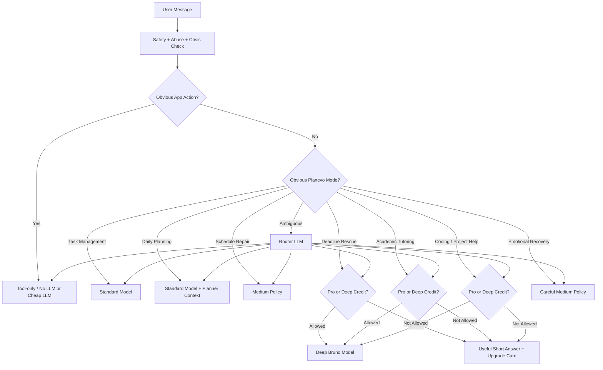

# Planevo Bruno Mode-Based Routing, Pro Gating, and Cost-Control Implementation Spec

**Document purpose:** This file is a backend implementation handoff for an AI coding agent. It describes how to rebuild Bruno's model-routing logic so Planevo can keep free users genuinely useful, make Pro feel valuable, and prevent AI costs from exploding as usage grows.

**Recommended implementation agent:** Use Codex as the primary implementer for backend wiring. Use Gemini 3.5 Flash / Antigravity as a secondary reviewer, UI reviewer, or alternate implementation pass if needed. Details are included below.

**Primary objective:** Bruno should not simply route messages as `simple` or `complex`. Bruno should route by **Planevo user value moment**: app action, basic chat, task management, daily planning, schedule repair, deadline rescue, academic tutoring, coding/project help, and emotional recovery.


## Launch-Safe Change

This version is updated for a low-budget launch.

The free plan no longer receives 1 or 3 Deep Bruno requests per day. That is too expensive and too risky before Planevo has meaningful revenue.

Updated launch policy:

```text
Free users receive 3 Deep Bruno onboarding credits TOTAL.
Free users receive 0 automatic daily Deep Bruno credits.
Optional earned credits may be added later for referrals, onboarding completion, or streaks.
Pro users receive a high but finite monthly Deep Bruno allowance.
```

This protects Planevo from losing money while still letting free users experience Deep Bruno enough to understand the upgrade value.


---

## 1. Product Philosophy

Planevo is not a generic chatbot. Planevo is a student-first AI planner. Bruno's intelligence should be spent where it creates the most perceived product value.

The routing system must optimize for five things at the same time:

1. Keep AI costs low.
2. Keep latency low.
3. Make free Bruno genuinely useful.
4. Make Pro Bruno clearly worth paying for.
5. Avoid making free Bruno feel intentionally dumb.

The free plan should create this feeling:

> "Bruno is useful, but I can tell the powerful version is Pro."

The free plan should **not** create this feeling:

> "Bruno is bad."

If free Bruno feels bad, users will not reliably upgrade. They will churn. The upgrade moment should feel like hitting a ceiling, not like using a broken product.

---

## 2. Final Routing Architecture

The final backend flow should be:



The key change is that Bruno routes by **mode** rather than by raw difficulty.

---

## 3. Core Bruno Modes

Create a shared backend type:

```ts
export type BrunoMode =
  | "app_action"
  | "basic_chat"
  | "task_management"
  | "daily_planning"
  | "schedule_repair"
  | "deadline_rescue"
  | "academic_tutoring"
  | "project_breakdown"
  | "coding_help"
  | "emotional_recovery"
  | "account_or_billing"
  | "unsafe";
```

### 3.1 Mode Definitions

#### `app_action`

Direct product manipulation.

Examples:
- "Move math homework to tomorrow."
- "Mark this done."
- "Add a task called read chapter 5."
- "Reschedule my workout to 7."
- "Delete that task."
- "Show today's plan."

Preferred handling:
- Tool-only if possible.
- No model if the UI can confirm deterministically.
- Cheap model only if natural-language clarification is needed.

Pro gate:
- Never Pro-gate basic app actions.

#### `basic_chat`

Light conversation and simple support.

Examples:
- "Hey Bruno."
- "What can you do?"
- "How should I start my day?"
- "Give me a quick motivation boost."

Preferred handling:
- Standard model.
- Short output cap.

Pro gate:
- No.

#### `task_management`

Basic planning and organization.

Examples:
- "Help me organize these tasks."
- "Which task should I do first?"
- "Can you make this list cleaner?"
- "I have homework, laundry, and studying."

Preferred handling:
- Standard model.
- Task context only.
- Do not load unnecessary calendar/Canvas context unless required.

Pro gate:
- No.

#### `daily_planning`

Daily plan creation or adjustment.

Examples:
- "Plan my afternoon."
- "Make me a realistic plan for today."
- "I have school until 2:30 and work at 5."
- "What should my night look like?"

Preferred handling:
- Standard model with planner prompt.
- Calendar/task context if available.
- Keep response concise and actionable.

Pro gate:
- No for basic daily plans.
- Pro-gate only deeper optimization, full week planning, Canvas-aware plans, or long rescue planning.

#### `schedule_repair`

Fixing a broken day without full emergency/deep mode.

Examples:
- "I got behind. Fix the rest of my day."
- "I missed my morning tasks."
- "I only have two hours now."
- "I need to recover my schedule."

Preferred handling:
- Medium policy.
- Use task/calendar context.
- Give a no-shame recovery plan.
- This is a core Planevo emotional value moment.

Pro gate:
- Usually no.
- If request becomes multi-day, deadline-heavy, or academically complex, upgrade to `deadline_rescue`.

#### `deadline_rescue`

High-value Planevo moment where Bruno helps a student recover from academic pressure.

Examples:
- "I have three missing assignments, two tests, and I feel behind. Fix my week."
- "My essay is due tomorrow and I haven't started."
- "I have a test Friday and a project Wednesday. Rescue me."
- "I need a real plan to catch up."

Preferred handling:
- Deep model for Pro.
- Deep credit for free users if available.
- If no credit, provide useful short answer plus upgrade card.

Pro gate:
- Yes. This is one of the strongest Pro moments.

#### `academic_tutoring`

Study help and subject explanation.

Examples:
- "Explain alpha and beta glycosidic linkages."
- "Teach me AP Macro Unit 1."
- "Make me a study plan for AP World."
- "Explain this physics concept."

Preferred handling:
- Deep model for Pro if multi-step, AP-level, STEM-heavy, or long-form.
- Standard model for short surface-level explanations.
- Use active recall, examples, and "must know" sections.

Pro gate:
- Pro-gate full tutoring, AP exam prep, long study plans, practice questions, and personalized revision loops.

#### `project_breakdown`

Multi-step project execution.

Examples:
- "Break down my research paper into steps."
- "Make a plan to finish this video project."
- "Help me build my app feature."
- "Create a project plan for the next 2 weeks."

Preferred handling:
- Deep model if long or multi-phase.
- Standard model for small breakdowns.

Pro gate:
- Yes for long, personalized, multi-day breakdowns.

#### `coding_help`

Technical implementation help.

Examples:
- "Fix this Next.js API route."
- "Help me wire Supabase auth into this."
- "Explain this React Native error."
- "Build a migration for this schema."

Preferred handling:
- Deep model.
- Strong code-context boundaries.
- Do not hallucinate file paths. Inspect repo first when possible.

Pro gate:
- Yes.

#### `emotional_recovery`

A user is demoralized, ashamed, overwhelmed, or spiraling about productivity.

Examples:
- "I wasted the whole day."
- "I feel like giving up."
- "I am behind and I hate myself for it."
- "I can't start."

Preferred handling:
- Medium policy.
- Do not over-gate.
- Keep response emotionally intelligent, shame-free, and action-oriented.
- Avoid generic wellness filler.
- If self-harm/crisis language appears, trigger safety path.

Pro gate:
- Usually no. Emotional trust is retention-critical.

#### `account_or_billing`

Plan, subscription, feature limits, login, usage.

Preferred handling:
- No model or standard model.
- Use backend plan state if available.
- Never invent billing details.

Pro gate:
- No.

#### `unsafe`

Self-harm, violence, sexual content involving minors, abuse, illegal activity, or other policy-triggering categories.

Preferred handling:
- Safety handler.
- Do not send to normal Bruno generation.
- Use appropriate safety response.

---

## 4. Recommended Model Policy

Create a centralized file:

`apps/web/lib/bruno/modelPolicy.ts`

Never hardcode model names across the codebase. Use environment aliases.

```ts
export const BRUNO_MODELS = {
  ROUTER: process.env.BRUNO_ROUTER_MODEL ?? "gpt-4o-mini",
  STANDARD: process.env.BRUNO_STANDARD_MODEL ?? "gpt-4o-mini",
  MEDIUM: process.env.BRUNO_MEDIUM_MODEL ?? "gpt-4o-mini",
  DEEP: process.env.BRUNO_DEEP_MODEL ?? "o3-mini",
} as const;
```

Policy map:

```ts
import type { BrunoMode } from "./types";

export type ModelTier = "none" | "standard" | "medium" | "deep";

export type BrunoModelPolicy = {
  tier: ModelTier;
  proLocked: boolean;
  freeCreditsAllowed: boolean;
  includeTasks: boolean;
  includeCalendar: boolean;
  includeCanvas: boolean;
  maxOutputTokens: number;
  temperature: number;
  upgradeCardEligible: boolean;
};

export const MODEL_POLICY: Record<BrunoMode, BrunoModelPolicy> = {
  app_action: {
    tier: "none",
    proLocked: false,
    freeCreditsAllowed: false,
    includeTasks: true,
    includeCalendar: false,
    includeCanvas: false,
    maxOutputTokens: 300,
    temperature: 0.2,
    upgradeCardEligible: false,
  },

  basic_chat: {
    tier: "standard",
    proLocked: false,
    freeCreditsAllowed: false,
    includeTasks: false,
    includeCalendar: false,
    includeCanvas: false,
    maxOutputTokens: 500,
    temperature: 0.6,
    upgradeCardEligible: false,
  },

  task_management: {
    tier: "standard",
    proLocked: false,
    freeCreditsAllowed: false,
    includeTasks: true,
    includeCalendar: false,
    includeCanvas: false,
    maxOutputTokens: 700,
    temperature: 0.35,
    upgradeCardEligible: false,
  },

  daily_planning: {
    tier: "standard",
    proLocked: false,
    freeCreditsAllowed: false,
    includeTasks: true,
    includeCalendar: true,
    includeCanvas: false,
    maxOutputTokens: 900,
    temperature: 0.35,
    upgradeCardEligible: false,
  },

  schedule_repair: {
    tier: "medium",
    proLocked: false,
    freeCreditsAllowed: false,
    includeTasks: true,
    includeCalendar: true,
    includeCanvas: false,
    maxOutputTokens: 1000,
    temperature: 0.35,
    upgradeCardEligible: true,
  },

  deadline_rescue: {
    tier: "deep",
    proLocked: true,
    freeCreditsAllowed: true,
    includeTasks: true,
    includeCalendar: true,
    includeCanvas: true,
    maxOutputTokens: 1600,
    temperature: 0.25,
    upgradeCardEligible: true,
  },

  academic_tutoring: {
    tier: "deep",
    proLocked: true,
    freeCreditsAllowed: true,
    includeTasks: false,
    includeCalendar: false,
    includeCanvas: true,
    maxOutputTokens: 1800,
    temperature: 0.25,
    upgradeCardEligible: true,
  },

  project_breakdown: {
    tier: "deep",
    proLocked: true,
    freeCreditsAllowed: true,
    includeTasks: true,
    includeCalendar: true,
    includeCanvas: true,
    maxOutputTokens: 1800,
    temperature: 0.3,
    upgradeCardEligible: true,
  },

  coding_help: {
    tier: "deep",
    proLocked: true,
    freeCreditsAllowed: true,
    includeTasks: false,
    includeCalendar: false,
    includeCanvas: false,
    maxOutputTokens: 2000,
    temperature: 0.2,
    upgradeCardEligible: true,
  },

  emotional_recovery: {
    tier: "medium",
    proLocked: false,
    freeCreditsAllowed: false,
    includeTasks: true,
    includeCalendar: true,
    includeCanvas: false,
    maxOutputTokens: 900,
    temperature: 0.45,
    upgradeCardEligible: false,
  },

  account_or_billing: {
    tier: "standard",
    proLocked: false,
    freeCreditsAllowed: false,
    includeTasks: false,
    includeCalendar: false,
    includeCanvas: false,
    maxOutputTokens: 500,
    temperature: 0.2,
    upgradeCardEligible: false,
  },

  unsafe: {
    tier: "none",
    proLocked: false,
    freeCreditsAllowed: false,
    includeTasks: false,
    includeCalendar: false,
    includeCanvas: false,
    maxOutputTokens: 500,
    temperature: 0.2,
    upgradeCardEligible: false,
  },
};
```

---

## 5. Routing Cascade

Do not call an LLM router on every message. That adds latency and cost.

Use this cascade:

1. Safety check.
2. Deterministic app-action detector.
3. Obvious mode detector.
4. LLM router only when ambiguous.
5. Model policy resolver.
6. Quota/plan resolver.
7. Generation.
8. Server-side upgrade card injection.
9. Usage logging.

### 5.1 Why this is better than LLM-router-every-time

Many Planevo messages are obvious:

- "Mark done."
- "Move it to tomorrow."
- "Add math homework."
- "Plan my day."
- "What is next?"

Those should not pay a router-model tax every time.

The LLM router should only handle messages where rules are not enough.

---

## 6. Router Output Schema

Create:

`apps/web/lib/bruno/routerSchema.ts`

```ts
import { z } from "zod";

export const brunoRouteSchema = z.object({
  mode: z.enum([
    "app_action",
    "basic_chat",
    "task_management",
    "daily_planning",
    "schedule_repair",
    "deadline_rescue",
    "academic_tutoring",
    "project_breakdown",
    "coding_help",
    "emotional_recovery",
    "account_or_billing",
    "unsafe",
  ]),
  confidence: z.number().min(0).max(1),
  needsCalendarContext: z.boolean(),
  needsTaskContext: z.boolean(),
  needsCanvasContext: z.boolean(),
  estimatedOutputSize: z.enum(["short", "medium", "long"]),
  upgradeMoment: z.boolean(),
  rationale: z.string().max(160),
});

export type BrunoRouteDecision = z.infer<typeof brunoRouteSchema>;
```

Do not store or expose detailed chain-of-thought style reasoning. Store only a short operational rationale such as:

- `"direct task mutation"`
- `"academic multi-step tutoring"`
- `"deadline rescue with multi-day planning"`
- `"emotional recovery without crisis language"`

---

## 7. Router Prompt

Create:

`apps/web/lib/bruno/routerPrompt.ts`

```ts
export const BRUNO_ROUTER_SYSTEM_PROMPT = `
You are Bruno's backend routing classifier for Planevo, a student-first AI planner.

Classify the user's latest message into exactly one mode.

Important:
- Do not route based on fancy wording alone.
- Route based on what the user is actually trying to do.
- Prefer app_action when the user wants to create, update, delete, move, complete, or view tasks/plans.
- Prefer daily_planning for normal day planning.
- Prefer schedule_repair when the user got behind but does not need full multi-day rescue.
- Prefer deadline_rescue when the user has urgent deadlines, missing assignments, tests, essays, or a multi-day catch-up problem.
- Prefer academic_tutoring for school subject explanation, exam prep, practice questions, or study plans.
- Prefer coding_help for programming, repo, backend, frontend, Supabase, Vercel, TypeScript, React, or API implementation.
- Prefer emotional_recovery when the user expresses shame, overwhelm, defeat, guilt, or productivity-related distress.
- Prefer unsafe only if the message requires safety handling.

Return only structured data matching the schema.
`;
```

---

## 8. Deterministic App Action Detector

Create:

`apps/web/lib/bruno/detectAppAction.ts`

This should identify obvious task/product mutations before using the router.

Examples that should return `app_action`:
- `mark ... done`
- `complete ...`
- `move ... to tomorrow`
- `reschedule ...`
- `delete ...`
- `add a task`
- `create task`
- `show today`
- `what is next`
- `open my plan`
- `start focus timer`

Pseudo-code:

```ts
const APP_ACTION_PATTERNS = [
  /\b(mark|complete|finish)\b.+\b(done|complete|finished)\b/i,
  /\b(add|create|make)\b.+\b(task|assignment|todo|to-do)\b/i,
  /\b(move|reschedule|push|shift)\b.+\b(to|for|tomorrow|today|tonight|later|next week)\b/i,
  /\b(delete|remove|clear)\b.+\b(task|assignment|todo|to-do)\b/i,
  /\b(show|open|view)\b.+\b(today|plan|schedule|tasks?)\b/i,
  /\b(what'?s next|next task|next thing)\b/i,
];

export function detectAppAction(message: string): boolean {
  const normalized = message.trim().toLowerCase();
  return APP_ACTION_PATTERNS.some((pattern) => pattern.test(normalized));
}
```

Important:
- This detector should only catch obvious app actions.
- Do not overload it with academic/coding/planning logic.
- If uncertain, let the mode detector/router decide.

---

## 9. Obvious Mode Detector

Create:

`apps/web/lib/bruno/detectObviousMode.ts`

This is a cheap heuristic layer before the LLM router.

It should return either a high-confidence route or `null`.

Examples:

```ts
export function detectObviousMode(message: string): BrunoRouteDecision | null {
  const text = message.toLowerCase();

  if (detectAppAction(text)) {
    return {
      mode: "app_action",
      confidence: 0.95,
      needsCalendarContext: false,
      needsTaskContext: true,
      needsCanvasContext: false,
      estimatedOutputSize: "short",
      upgradeMoment: false,
      rationale: "obvious app action",
    };
  }

  if (/\b(ap|exam|test|quiz|study guide|teach me|explain|practice questions)\b/.test(text)) {
    return {
      mode: "academic_tutoring",
      confidence: 0.82,
      needsCalendarContext: false,
      needsTaskContext: false,
      needsCanvasContext: false,
      estimatedOutputSize: "medium",
      upgradeMoment: true,
      rationale: "academic tutoring keywords",
    };
  }

  if (/\b(next\.?js|react|typescript|supabase|vercel|api route|backend|frontend|database|migration|github|repo)\b/.test(text)) {
    return {
      mode: "coding_help",
      confidence: 0.86,
      needsCalendarContext: false,
      needsTaskContext: false,
      needsCanvasContext: false,
      estimatedOutputSize: "long",
      upgradeMoment: true,
      rationale: "coding implementation request",
    };
  }

  if (/\b(behind|missed|catch up|catch-up|rescue|overdue|due tomorrow|missing assignment|fix my week)\b/.test(text)) {
    return {
      mode: "deadline_rescue",
      confidence: 0.8,
      needsCalendarContext: true,
      needsTaskContext: true,
      needsCanvasContext: true,
      estimatedOutputSize: "long",
      upgradeMoment: true,
      rationale: "deadline or catch-up rescue",
    };
  }

  if (/\b(wasted the day|feel behind|giving up|can't start|overwhelmed|stressed|hate myself|failure)\b/.test(text)) {
    return {
      mode: "emotional_recovery",
      confidence: 0.78,
      needsCalendarContext: true,
      needsTaskContext: true,
      needsCanvasContext: false,
      estimatedOutputSize: "medium",
      upgradeMoment: false,
      rationale: "emotional recovery signal",
    };
  }

  if (/\b(plan my day|plan today|schedule my day|what should i do today|daily plan)\b/.test(text)) {
    return {
      mode: "daily_planning",
      confidence: 0.83,
      needsCalendarContext: true,
      needsTaskContext: true,
      needsCanvasContext: false,
      estimatedOutputSize: "medium",
      upgradeMoment: false,
      rationale: "daily planning request",
    };
  }

  return null;
}
```

This detector does not replace the LLM router. It reduces unnecessary router calls.

---

## 10. User Plan and Credit Policy

Create:

`apps/web/lib/bruno/usagePolicy.ts`

This is the launch-safe policy. It is intentionally conservative because Planevo is launching without a large AI budget.

### 10.1 Free Plan

Free users should receive:

- Basic app actions.
- Standard chat.
- Basic task management.
- Basic daily planning.
- Basic schedule repair.
- Emotional recovery support.
- A limited Deep Bruno trial.

Recommended free Deep Bruno policy for launch:

```text
3 Deep Bruno onboarding credits TOTAL.
0 automatic daily Deep Bruno credits.
No daily refill.
No rollover.
No unlimited free deep mode.
```

This means a free user can experience the strongest version of Bruno a few times, but they cannot become an expensive daily AI user without upgrading.

Free users should still be able to use normal Bruno after their Deep Bruno credits are gone. The app should not become useless. The user should hit a Pro ceiling only on high-value deep moments.

### 10.2 Optional Earned Credits

Do not launch with generous daily credits. If growth and cost look healthy, add earned credits later.

Optional future credit rewards:

```text
Finish onboarding: +1 Deep Bruno credit
7-day planning streak: +1 Deep Bruno credit
Invite a friend who signs up: +2 Deep Bruno credits
Manual support adjustment: variable
```

Earned credits should be rare and tied to retention or growth. They should not become a hidden daily refill system.

### 10.3 Pro Plan

Recommended Pro policy for early launch:

```text
200 Deep Bruno requests/month.
Soft warning at 160.
Hard fallback at 200.
After the cap, user keeps Standard Bruno.
Basic planning never gets blocked.
```

Alternative safer launch cap:

```text
150 Deep Bruno requests/month.
```

A Pro user should not feel constantly limited, but Planevo still needs a fair-use boundary.

Recommended Pro behavior:

- Pro users get Deep Bruno for deadline rescue, full academic tutoring, long project breakdowns, and coding help.
- Pro users still use cheap routes for cheap requests.
- Pro users do not consume free onboarding credits.
- Pro users should receive standard Bruno fallback if they hit the monthly deep cap.

### 10.4 Example Entitlement Type

```ts
export type BrunoEntitlement = {
  isPro: boolean;

  // Free-user Deep Bruno trial credits.
  onboardingDeepCreditsRemaining: number;

  // Optional future earned credits. Do not auto-refill daily at launch.
  earnedDeepCreditsRemaining: number;

  // Pro monthly allowance.
  monthlyDeepRequestsRemaining: number;

  // Optional extra protection if you want budget-based limiting.
  monthlyAiBudgetCentsRemaining: number | null;

  abuseScore: number;
};
```

### 10.5 Upgrade Logic

A user may access Deep Bruno when:

```ts
isPro === true
OR onboardingDeepCreditsRemaining > 0
OR earnedDeepCreditsRemaining > 0
```

A free user should not receive automatic daily Deep Bruno credits at launch.

If the user is free and no Deep Bruno credit remains:

- Do not call the deep model.
- Use the standard model.
- Cap response length.
- Add an upgrade card server-side.
- Keep the answer useful enough that Bruno still feels competent.

---

## 11. Database Schema

Create a Supabase migration.

Suggested file:

`supabase/migrations/YYYYMMDDHHMMSS_add_bruno_routing_usage.sql`

### 11.1 `ai_usage_logs`

If this table already exists, alter it carefully instead of recreating it.

```sql
create table if not exists public.ai_usage_logs (
  id uuid primary key default gen_random_uuid(),
  user_id uuid not null references auth.users(id) on delete cascade,
  feature_key text not null,
  model text,
  mode text,
  route_tier text,
  input_tokens integer default 0,
  output_tokens integer default 0,
  estimated_cost_cents numeric(10, 6) default 0,
  created_at timestamptz not null default now()
);

create index if not exists ai_usage_logs_user_created_idx
on public.ai_usage_logs (user_id, created_at desc);

create index if not exists ai_usage_logs_feature_user_created_idx
on public.ai_usage_logs (feature_key, user_id, created_at desc);
```

### 11.2 `bruno_route_events`

```sql
create table if not exists public.bruno_route_events (
  id uuid primary key default gen_random_uuid(),
  user_id uuid not null references auth.users(id) on delete cascade,
  message_id text,
  conversation_id text,
  mode text not null,
  confidence numeric(4, 3),
  route_source text not null check (route_source in ('deterministic', 'obvious_mode', 'llm_router', 'fallback')),
  selected_tier text not null,
  selected_model text,
  is_pro boolean not null default false,
  used_deep_credit boolean not null default false,
  upgrade_card_shown boolean not null default false,
  estimated_input_tokens integer default 0,
  estimated_output_tokens integer default 0,
  estimated_cost_cents numeric(10, 6) default 0,
  latency_ms integer,
  rationale text,
  created_at timestamptz not null default now()
);

create index if not exists bruno_route_events_user_created_idx
on public.bruno_route_events (user_id, created_at desc);

create index if not exists bruno_route_events_mode_created_idx
on public.bruno_route_events (mode, created_at desc);
```

### 11.3 `bruno_credit_ledger`

A ledger is safer than only storing counters because it makes debugging easier.

```sql
create table if not exists public.bruno_credit_ledger (
  id uuid primary key default gen_random_uuid(),
  user_id uuid not null references auth.users(id) on delete cascade,
  credit_type text not null check (credit_type in ('onboarding_deep', 'earned_deep', 'pro_monthly_deep', 'manual_adjustment')),
  delta integer not null,
  reason text,
  request_id text,
  created_at timestamptz not null default now()
);

create index if not exists bruno_credit_ledger_user_created_idx
on public.bruno_credit_ledger (user_id, created_at desc);
```

### 11.4 RLS Notes

Because usage logging is backend-only:
- Do not allow client inserts.
- Use service role only in server routes.
- Users may optionally read their own summary later, but not raw logs unless needed.

Example:

```sql
alter table public.ai_usage_logs enable row level security;
alter table public.bruno_route_events enable row level security;
alter table public.bruno_credit_ledger enable row level security;

-- Optional user read policies only if UI needs them.
create policy "Users can read own ai usage logs"
on public.ai_usage_logs for select
using (auth.uid() = user_id);

create policy "Users can read own bruno route events"
on public.bruno_route_events for select
using (auth.uid() = user_id);

create policy "Users can read own bruno credit ledger"
on public.bruno_credit_ledger for select
using (auth.uid() = user_id);
```

Do not add public insert/update policies.

---

## 12. Backend Files to Create or Modify

Expected files:

```text
apps/web/lib/bruno/types.ts
apps/web/lib/bruno/modelPolicy.ts
apps/web/lib/bruno/routerSchema.ts
apps/web/lib/bruno/routerPrompt.ts
apps/web/lib/bruno/detectAppAction.ts
apps/web/lib/bruno/detectObviousMode.ts
apps/web/lib/bruno/routeMessage.ts
apps/web/lib/bruno/usagePolicy.ts
apps/web/lib/bruno/usageService.ts
apps/web/lib/bruno/costEstimator.ts
apps/web/lib/bruno/upgradeCards.ts
apps/web/lib/bruno/brunoPrompts.ts
apps/web/app/api/ai/chat/route.ts
apps/web/lib/auth/rateLimit.ts
supabase/migrations/YYYYMMDDHHMMSS_add_bruno_routing_usage.sql
```

Do not blindly overwrite existing Bruno files. Inspect the current repo first.

---

## 13. Route Decision Function

Create:

`apps/web/lib/bruno/routeMessage.ts`

Pseudo-code:

```ts
import { generateObject } from "ai";
import { openai } from "@ai-sdk/openai";
import { brunoRouteSchema } from "./routerSchema";
import { BRUNO_MODELS } from "./modelPolicy";
import { BRUNO_ROUTER_SYSTEM_PROMPT } from "./routerPrompt";
import { detectAppAction } from "./detectAppAction";
import { detectObviousMode } from "./detectObviousMode";

export async function routeBrunoMessage(input: {
  userId: string;
  message: string;
  conversationId?: string;
}) {
  const start = Date.now();

  // 1. Obvious app action.
  if (detectAppAction(input.message)) {
    return {
      decision: {
        mode: "app_action",
        confidence: 0.95,
        needsCalendarContext: false,
        needsTaskContext: true,
        needsCanvasContext: false,
        estimatedOutputSize: "short",
        upgradeMoment: false,
        rationale: "obvious app action",
      },
      routeSource: "deterministic",
      latencyMs: Date.now() - start,
    };
  }

  // 2. Obvious mode.
  const obvious = detectObviousMode(input.message);
  if (obvious && obvious.confidence >= 0.78) {
    return {
      decision: obvious,
      routeSource: "obvious_mode",
      latencyMs: Date.now() - start,
    };
  }

  // 3. LLM router only for ambiguity.
  try {
    const result = await generateObject({
      model: openai(BRUNO_MODELS.ROUTER),
      schema: brunoRouteSchema,
      system: BRUNO_ROUTER_SYSTEM_PROMPT,
      prompt: `Classify this latest user message:\n\n${input.message}`,
      temperature: 0,
    });

    return {
      decision: result.object,
      routeSource: "llm_router",
      latencyMs: Date.now() - start,
    };
  } catch (error) {
    // Fail safe: standard model, not deep.
    return {
      decision: {
        mode: "basic_chat",
        confidence: 0.5,
        needsCalendarContext: false,
        needsTaskContext: false,
        needsCanvasContext: false,
        estimatedOutputSize: "medium",
        upgradeMoment: false,
        rationale: "router failure fallback",
      },
      routeSource: "fallback",
      latencyMs: Date.now() - start,
    };
  }
}
```

---

## 14. Model Resolver

Create a resolver that combines:
- Route decision.
- Model policy.
- User plan.
- Remaining deep credits.
- Budget cap.
- Abuse score.

Pseudo-code:

```ts
export async function resolveBrunoGenerationPlan(input: {
  userId: string;
  decision: BrunoRouteDecision;
  entitlement: BrunoEntitlement;
}) {
  const policy = MODEL_POLICY[input.decision.mode];

  if (policy.tier === "none") {
    return {
      tier: "none",
      model: null,
      shouldUseDeepCredit: false,
      shouldShowUpgradeCard: false,
      policy,
    };
  }

  if (policy.tier !== "deep") {
    return {
      tier: policy.tier,
      model: policy.tier === "medium" ? BRUNO_MODELS.MEDIUM : BRUNO_MODELS.STANDARD,
      shouldUseDeepCredit: false,
      shouldShowUpgradeCard: false,
      policy,
    };
  }

  if (input.entitlement.isPro) {
    return {
      tier: "deep",
      model: BRUNO_MODELS.DEEP,
      shouldUseDeepCredit: false,
      shouldShowUpgradeCard: false,
      policy,
    };
  }

  const hasFreeDeepCredit =
    input.entitlement.onboardingDeepCreditsRemaining > 0 ||
    input.entitlement.earnedDeepCreditsRemaining > 0;

  if (policy.freeCreditsAllowed && hasFreeDeepCredit) {
    return {
      tier: "deep",
      model: BRUNO_MODELS.DEEP,
      shouldUseDeepCredit: true,
      shouldShowUpgradeCard: false,
      policy,
    };
  }

  return {
    tier: "standard",
    model: BRUNO_MODELS.STANDARD,
    shouldUseDeepCredit: false,
    shouldShowUpgradeCard: policy.upgradeCardEligible,
    policy: {
      ...policy,
      maxOutputTokens: Math.min(policy.maxOutputTokens, 800),
      includeCanvas: false,
    },
  };
}
```

Important:
- Never let a free user with no deep credits silently hit the deep model.
- Never let a Pro user use deep model for obvious cheap app actions.
- Always log the selected tier and model.

---

## 15. Upgrade Card Strategy

Do not inject the upsell as a system prompt and hope the model appends it correctly.

Instead:
1. Generate the useful standard answer.
2. Server-side append metadata or a separate UI event.
3. Render a proper card in the frontend.

Suggested server payload:

```ts
type BrunoUpgradeCard = {
  type: "bruno_upgrade_card";
  title: string;
  body: string;
  bullets: string[];
  ctaText: string;
  ctaHref: string;
};
```

Suggested card copy:

```ts
export function getBrunoUpgradeCard(mode: BrunoMode): BrunoUpgradeCard | null {
  if (mode === "academic_tutoring") {
    return {
      type: "bruno_upgrade_card",
      title: "Unlock Deep Bruno for full tutoring",
      body: "Your free answer is shortened. Deep Bruno can turn this into a full study session.",
      bullets: [
        "Step-by-step explanation",
        "Practice questions",
        "Mistake traps",
        "Personalized study plan",
      ],
      ctaText: "Upgrade to Pro",
      ctaHref: "/settings/billing",
    };
  }

  if (mode === "deadline_rescue") {
    return {
      type: "bruno_upgrade_card",
      title: "Unlock Deep Bruno for a full rescue plan",
      body: "Deep Bruno can rebuild your week around deadlines, energy, and available time.",
      bullets: [
        "Multi-day catch-up plan",
        "Calendar-aware schedule",
        "Deadline triage",
        "No-shame rollover strategy",
      ],
      ctaText: "Upgrade to Pro",
      ctaHref: "/settings/billing",
    };
  }

  return {
    type: "bruno_upgrade_card",
    title: "Unlock Deep Bruno",
    body: "Deep Bruno gives longer, smarter, more personalized help for complex requests.",
    bullets: ["Deeper reasoning", "Longer plans", "More context", "Better revisions"],
    ctaText: "Upgrade to Pro",
    ctaHref: "/settings/billing",
  };
}
```

---

## 16. Prompt Strategy

Create:

`apps/web/lib/bruno/brunoPrompts.ts`

Base prompt should always include:
- Bruno is Planevo's shame-free planning assistant.
- Bruno should be useful, direct, and emotionally safe.
- Bruno should avoid generic productivity filler.
- Bruno should prefer concrete next actions.
- Bruno should not claim to change tasks unless a tool actually changed them.
- Bruno should not invent calendar/Canvas/task data.

Mode-specific prompt fragments should be injected based on mode.

### 16.1 Deadline Rescue Prompt Fragment

```ts
export const DEADLINE_RESCUE_PROMPT = `
DEADLINE RESCUE MODE:
The user is behind, under pressure, or facing urgent academic deadlines.
Respond with:
1. A calm triage summary.
2. The smallest immediate next action.
3. A realistic catch-up sequence.
4. What to defer, shrink, or skip.
5. A no-shame recovery tone.

Do not lecture the user.
Do not over-plan every minute unless the user asks.
Do not make the user feel worse.
`;
```

### 16.2 Academic Tutoring Prompt Fragment

```ts
export const ACADEMIC_TUTORING_PROMPT = `
ACADEMIC TUTORING MODE:
Act as a strong subject-matter tutor.
Explain the mechanism, not just the answer.
When useful, include:
- Must-know facts.
- Common mistakes.
- One worked example.
- A quick active-recall check.

Keep the explanation age-appropriate but not childish.
Do not overcomplicate simple questions.
`;
```

### 16.3 Emotional Recovery Prompt Fragment

```ts
export const EMOTIONAL_RECOVERY_PROMPT = `
EMOTIONAL RECOVERY MODE:
The user may feel ashamed, overwhelmed, stuck, or defeated.
Respond with calm, practical support.
Use a no-shame tone.
Move the user toward one tiny concrete action.
Avoid generic wellness clichés.
Do not diagnose the user.
If there is self-harm or immediate danger language, use the safety path.
`;
```

### 16.4 Coding Help Prompt Fragment

```ts
export const CODING_HELP_PROMPT = `
CODING HELP MODE:
Be precise and implementation-oriented.
Do not invent files or codebase state.
If repo context is missing, state the assumption.
Prefer:
- File-by-file changes.
- Type-safe code.
- Database migration safety.
- Server/client boundary correctness.
- Verification steps.
`;
```

---

## 17. Chat Route Integration

Target:

`apps/web/app/api/ai/chat/route.ts`

Expected flow:

```ts
export async function POST(req: Request) {
  const start = Date.now();

  // 1. Auth user.
  const user = await requireUser(req);

  // 2. Parse request body.
  const { messages, conversationId } = await req.json();
  const lastUserMessage = getLastUserMessage(messages);

  // 3. Safety check.
  const safety = checkBrunoSafety(lastUserMessage);
  if (!safety.ok) {
    return safetyResponse(safety);
  }

  // 4. Route message.
  const routeResult = await routeBrunoMessage({
    userId: user.id,
    message: lastUserMessage,
    conversationId,
  });

  // 5. Fetch entitlement.
  const entitlement = await getBrunoEntitlement(user.id);

  // 6. Resolve generation plan.
  const generationPlan = await resolveBrunoGenerationPlan({
    userId: user.id,
    decision: routeResult.decision,
    entitlement,
  });

  // 7. If app action, execute tool path.
  if (generationPlan.tier === "none" && routeResult.decision.mode === "app_action") {
    const result = await handleAppAction({ user, message: lastUserMessage });
    await logBrunoRouteEvent(...);
    return Response.json(result);
  }

  // 8. Fetch only needed context.
  const context = await buildBrunoContext({
    userId: user.id,
    includeTasks: generationPlan.policy.includeTasks,
    includeCalendar: generationPlan.policy.includeCalendar,
    includeCanvas: generationPlan.policy.includeCanvas,
  });

  // 9. If deep credit should be used, reserve/consume it.
  if (generationPlan.shouldUseDeepCredit) {
    await consumeDeepCredit(user.id, {
      reason: routeResult.decision.mode,
      requestId: crypto.randomUUID(),
    });
  }

  // 10. Build system prompt.
  const system = buildBrunoSystemPrompt({
    mode: routeResult.decision.mode,
    context,
    generationPlan,
  });

  // 11. Stream response.
  const stream = streamText({
    model: openai(generationPlan.model),
    system,
    messages,
    maxOutputTokens: generationPlan.policy.maxOutputTokens,
    temperature: generationPlan.policy.temperature,
    onFinish: async (event) => {
      await logAiUsage(...);
      await logBrunoRouteEvent(...);
    },
  });

  // 12. Attach upgrade card metadata if needed.
  return stream.toDataStreamResponse({
    headers: {
      "x-bruno-mode": routeResult.decision.mode,
      "x-bruno-tier": generationPlan.tier,
      "x-bruno-upgrade-card": generationPlan.shouldShowUpgradeCard ? "true" : "false",
    },
  });
}
```

Exact code will depend on the current Vercel AI SDK version and existing route structure. The agent must inspect the current repo before editing.

---

## 18. Cost Estimator

Create:

`apps/web/lib/bruno/costEstimator.ts`

Use current provider prices in environment-configurable constants.

```ts
export type TokenUsage = {
  inputTokens: number;
  outputTokens: number;
};

export type ModelPricing = {
  inputPerMillion: number;
  outputPerMillion: number;
};

export const MODEL_PRICING_USD: Record<string, ModelPricing> = {
  "gpt-4o-mini": { inputPerMillion: 0.15, outputPerMillion: 0.60 },
  "o3-mini": { inputPerMillion: 1.10, outputPerMillion: 4.40 },

  // Optional current-generation aliases. Update before deploy.
  "gpt-5.4-mini": { inputPerMillion: 0.75, outputPerMillion: 4.50 },
  "gpt-5.4": { inputPerMillion: 2.50, outputPerMillion: 15.00 },

  // Gemini examples. Update before deploy.
  "gemini-3.5-flash": { inputPerMillion: 1.50, outputPerMillion: 9.00 },
  "gemini-3.1-flash-lite": { inputPerMillion: 0.25, outputPerMillion: 1.50 },
  "gemini-3.1-pro-preview": { inputPerMillion: 2.00, outputPerMillion: 12.00 },
};

export function estimateModelCostUsd(model: string, usage: TokenUsage) {
  const pricing = MODEL_PRICING_USD[model];

  if (!pricing) {
    return 0;
  }

  const inputCost = (usage.inputTokens / 1_000_000) * pricing.inputPerMillion;
  const outputCost = (usage.outputTokens / 1_000_000) * pricing.outputPerMillion;

  return inputCost + outputCost;
}

export function estimateModelCostCents(model: string, usage: TokenUsage) {
  return estimateModelCostUsd(model, usage) * 100;
}
```

Important:
- This is an estimator.
- Actual provider invoices may differ due to cached inputs, reasoning tokens, retries, failed calls, tools, search, batch, flex, and provider-specific token accounting.
- Log actual usage returned by the SDK/provider when available.

---

## 19. Cost Model for Planevo

These estimates are for Bruno text chat only.

They do not include:
- Supabase.
- Vercel.
- Stripe.
- Google Calendar API.
- Canvas integration infrastructure.
- Search/grounding tools.
- Images.
- Voice/audio.
- Failed retries.
- Observability tools.

### 19.1 Per-Request Cost Assumptions

Using the launch model stack:

- Router model: `gpt-4o-mini`
- Standard model: `gpt-4o-mini`
- Medium model: `gpt-4o-mini` with more context/output
- Deep model: `o3-mini`

Approximate per-request costs:

| Request Type | Tokens Assumed | Approx Cost |
|---|---:|---:|
| Tool-only app action | No LLM | ~$0.000000 |
| Router call | 350 input / 80 output | ~$0.000101 |
| Standard response | 1,500 input / 600 output | ~$0.000585 |
| Medium response | 2,000 input / 900 output | ~$0.000840 |
| Deep response | 4,000 input / 1,500 output | ~$0.011000 |
| Long deep response | 8,000 input / 3,000 output | ~$0.022000 |

These are estimates. Make pricing environment-configurable and re-check provider pricing before deployment.

### 19.2 Why the Launch Policy Changed

The old free policy gave users recurring daily Deep Bruno credits. That is not safe for a low-budget launch.

Dangerous policy:

```text
3 Deep Bruno requests/day/free user
```

At only 100 free users:

```text
100 users * 3 deep requests/day = 300 deep requests/day
300 * $0.011 = $3.30/day
$3.30/day * 30 = ~$99/month
```

At 1,000 free users:

```text
1,000 users * 3 deep requests/day = 3,000 deep requests/day
3,000 * $0.011 = $33/day
$33/day * 30 = ~$990/month
```

That is too risky before Planevo has strong revenue.

Launch-safe policy:

```text
3 Deep Bruno onboarding credits TOTAL.
0 daily free Deep Bruno credits.
```

At 100 new free users:

```text
100 users * 3 lifetime credits = 300 total deep requests
300 * $0.011 = ~$3.30 one-time
```

At 1,000 new free users:

```text
1,000 users * 3 lifetime credits = 3,000 total deep requests
3,000 * $0.011 = ~$33 one-time
```

The key difference:

```text
Old daily-credit model: recurring monthly risk.
New onboarding-credit model: controlled one-time acquisition cost.
```

### 19.3 Free User Ongoing Cost Without Daily Deep Credits

Assumed free-user traffic mix after onboarding credits are gone:

- 50% tool-only app actions.
- 40% standard responses.
- 10% medium responses.
- 0% automatic deep responses.
- Router used on 30% of all messages.

Estimated average cost:

```text
Tool-only: 50% * $0.000000 = $0.000000
Standard:  40% * $0.000585 = $0.000234
Medium:    10% * $0.000840 = $0.000084
Deep:       0% * $0.011000 = $0.000000
Router:    30% * $0.000101 = $0.000030

Estimated free ongoing average = ~$0.000348 per Bruno message
```

At 1,000 free DAU with 8 Bruno messages per day:

```text
1,000 users * 8 messages/day * $0.000348 = $2.78/day
$2.78/day * 30 days = ~$83/month
```

So 1,000 active free users should cost roughly:

```text
~$80–$100/month
```

for ongoing Bruno text chat, plus the one-time onboarding-credit cost for new signups.

### 19.4 Free User Cost With New Signups

Onboarding credits cost money only when new users actually use them.

If each new free user uses all 3 onboarding credits:

| New Free Users / Month | Deep Credits Used | Estimated One-Time Deep Cost |
|---:|---:|---:|
| 100 | 300 | ~$3.30 |
| 500 | 1,500 | ~$16.50 |
| 1,000 | 3,000 | ~$33.00 |
| 5,000 | 15,000 | ~$165.00 |

This is survivable because it scales with acquisition, not daily free usage.

### 19.5 Example Public Launch Cost

Assume:

- 1,000 free DAU.
- 8 Bruno messages/day/free user.
- 500 new users that month using all 3 onboarding credits.
- 0 automatic daily Deep Bruno credits.

Cost:

```text
Ongoing free usage:
1,000 * 8 * $0.000348 * 30 = ~$83/month

Onboarding Deep Bruno trial cost:
500 * 3 * $0.011 = ~$16.50 one-time

Estimated free monthly Bruno cost:
~$99.50/month
```

Round this to:

```text
~$100/month for 1,000 active free users
```

under the launch-safe policy.

### 19.6 Pro User Cost

Assumed Pro-user traffic mix:

- 20% tool-only.
- 45% standard.
- 15% medium.
- 20% deep.
- Router used on 50% of all messages.

Estimated average cost:

```text
Tool-only: 20% * $0.000000 = $0.000000
Standard:  45% * $0.000585 = $0.000263
Medium:    15% * $0.000840 = $0.000126
Deep:      20% * $0.011000 = $0.002200
Router:    50% * $0.000101 = $0.000051

Estimated Pro average = ~$0.00264 per Bruno message
```

At 100 Pro DAU with 15 Bruno messages per day:

```text
100 users * 15 messages * $0.00264 = $3.96/day
$3.96/day * 30 days = ~$119/month
```

### 19.7 Pro Cap Math

Recommended early launch Pro cap:

```text
200 Deep Bruno requests/month
```

Deep model cost at normal depth:

```text
200 * $0.011 = $2.20/month/user
```

Deep model cost at long depth:

```text
200 * $0.022 = $4.40/month/user
```

At a $9.99 Pro price, this is still viable, but the app also has Stripe, Vercel, Supabase, failed calls, and support costs.

Safer launch cap if money is extremely tight:

```text
150 Deep Bruno requests/month
```

At normal depth:

```text
150 * $0.011 = $1.65/month/user
```

At long depth:

```text
150 * $0.022 = $3.30/month/user
```

Recommended behavior after cap:

- Warn user before the cap.
- Fall back to Standard Bruno after the cap.
- Do not block task planning.
- Do not block app actions.
- Do not make the product unusable.

### 19.8 Combined Launch Example

At:

- 1,000 free DAU.
- 100 Pro DAU.
- 500 new free users that month.
- Free users average 8 Bruno messages/day.
- Pro users average 15 Bruno messages/day.
- Free users get 3 onboarding credits total, not daily.

Estimated monthly Bruno API cost:

```text
Free ongoing usage:      ~$83
Free onboarding credits: ~$17
Pro usage:               ~$119

Total:                   ~$219/month
```

Round this to:

```text
~$200–$250/month
```

for Bruno text chat.

This is much safer than the old recurring daily-credit policy.

### 19.9 Very Early Stage Cost

During development:

```text
~$5–$20/month
```

Private beta with 10–50 users:

```text
~$10–$40/month
```

Small public launch:

```text
~$50–$150/month
```

Public launch with 1,000 free DAU and some Pro users:

```text
~$200–$250/month
```

### 19.10 Worst-Case Warning

If you accidentally allow free users to hit Deep Bruno every day, your costs can climb fast.

At 1,000 free users with 3 deep requests/day:

```text
~$990/month just from free deep requests
```

At 10,000 free users with 3 deep requests/day:

```text
~$9,900/month just from free deep requests
```

Do not launch with recurring free daily Deep Bruno credits unless Planevo already has enough paying users to cover it.

### 19.11 Final Cost Rule

For launch:

```text
Free Bruno = useful daily planner.
Deep Bruno = limited trial + Pro upgrade path.
```

Cost-control target:

```text
90–95% of free usage should stay on tool-only, standard, or medium routes.
0% of free usage should receive automatic daily Deep Bruno.
Deep Bruno for free users should be limited to onboarding or earned credits only.
```

---

## 20. Runtime Model Choice

### 20.1 Recommended Runtime Stack

For the app's Bruno runtime:

```text
Router:   gpt-4o-mini
Standard: gpt-4o-mini
Medium:   gpt-4o-mini with better prompt/context/output cap
Deep:     o3-mini
```

This is a practical early-stage stack because:
- Router cost is tiny.
- Standard responses are cheap.
- Deep reasoning is available only for high-value moments.
- The model names can be swapped later through environment variables.

### 20.2 Optional Gemini Runtime Stack

Possible Gemini stack:

```text
Router:   gemini-3.1-flash-lite
Standard: gemini-3.1-flash-lite or gemini-3.5-flash
Medium:   gemini-3.5-flash
Deep:     gemini-3.1-pro-preview or gemini-3.5-flash
```

However:
- Gemini 3.5 Flash has strong agentic/coding capability, but its standard token price may be higher than the cheap OpenAI standard stack.
- Gemini 3.1 Pro Preview is strong but more expensive than o3-mini in the example prices.
- If the app already uses the Vercel AI SDK and OpenAI provider, OpenAI is simpler to wire into the current route.

Recommendation:
- Keep the runtime provider abstraction clean.
- Do not make the entire app depend on one provider.
- Start with OpenAI for Bruno runtime if the current backend already uses it.
- Test Gemini as an alternate `DEEP` or `MEDIUM` provider later.

---

## 21. Implementation Agent Recommendation

### 21.1 Use Codex as Primary

Use Codex for the actual backend implementation because this task requires:
- Repo-aware file edits.
- TypeScript backend integration.
- Supabase migration changes.
- API route changes.
- Streaming response preservation.
- Auth/subscription checks.
- Server-only service role safety.
- Tests and verification.
- Git diff review.

Codex is the safer primary choice for this exact job.

### 21.2 Use Gemini 3.5 Flash / Antigravity as Secondary

Gemini 3.5 Flash / Antigravity is capable enough to help with:
- Reviewing the architecture.
- Generating alternate implementation ideas.
- UI card design.
- Finding edge cases.
- Running a second-pass code review.
- Refactoring after the Codex implementation.

But for backend wiring, do not blindly trust any agent. The important part is not just "can it write code?" The important part is whether it correctly wires:
- auth
- subscriptions
- Supabase service role
- route streaming
- usage logging
- migrations
- client/server boundaries
- error handling
- quota consumption
- no double-charging
- no accidental deep model calls

Recommended workflow:
1. Use Codex to implement on a new branch.
2. Commit after each phase.
3. Run tests.
4. Use Gemini/Antigravity as code reviewer.
5. Use Codex again to fix review issues.
6. Manually test the route with known prompts.

---

## 22. Agent Instructions to Paste into Codex

Paste this into Codex with the repo open:

```text
You are implementing Bruno's mode-based AI routing system for Planevo.

Do not rewrite unrelated files.
Do not break the current streaming/typewriter effect.
Do not remove existing Bruno safety logic.
Do not hardcode model names directly in the API route.
Do not expose service role keys to the client.
Do not let free users trigger the deep model without credits.
Do not consume a deep credit unless the request actually uses the deep model.
Do not inject upsells through the LLM prompt. Return or append upgrade-card metadata server-side.

Implementation requirements:
1. Inspect the existing Bruno chat route, auth helpers, Supabase client utilities, rate limit file, and current AI provider setup.
2. Create a mode-based routing system with:
   - app action detector
   - obvious mode detector
   - LLM router fallback using structured output
   - centralized model policy
   - entitlement/credit resolver
   - cost estimator
   - usage logging
3. Add Supabase migration for route events, usage logs, and credit ledger if these do not exist.
4. Integrate into apps/web/app/api/ai/chat/route.ts.
5. Preserve streaming behavior.
6. Add server-side upgrade card metadata for free users who hit a Deep Bruno moment without credits.
7. Add tests or at least a script/manual test table for route classification.
8. After implementation, provide a file-by-file summary and exact test commands.

Use the implementation spec in PLANEVO_BRUNO_ROUTING_IMPLEMENTATION.md as the source of truth.
```

---

## 23. Testing and Verification

Create a manual test matrix.

### 23.1 App Action Tests

| Prompt | Expected Mode | Expected Tier |
|---|---|---|
| "Move math homework to tomorrow" | app_action | none/tool |
| "Mark my essay done" | app_action | none/tool |
| "Add a task called study AP Macro" | app_action | none/tool |
| "What is next?" | app_action or daily_planning | none/tool or standard |

### 23.2 False Positive Tests

| Prompt | Expected Mode | Expected Tier |
|---|---|---|
| "Please synthesize a cohesive operational timeline for my mundane domestic chores" | task_management or daily_planning | standard |
| "Can you analyze my grocery list and evaluate what I should buy first?" | task_management | standard |
| "Strategically optimize my bedroom cleaning sequence" | task_management | standard |

These should not automatically hit the deep model just because the wording is fancy.

### 23.3 Deep Mode Tests

| Prompt | Expected Mode | Expected Tier |
|---|---|---|
| "Explain alpha and beta glycosidic linkages" | academic_tutoring | deep if Pro/credit |
| "Teach me AP Macro Unit 1 and quiz me" | academic_tutoring | deep if Pro/credit |
| "I have 3 missing assignments and 2 tests. Fix my week." | deadline_rescue | deep if Pro/credit |
| "Help me wire Supabase auth into this API route" | coding_help | deep if Pro/credit |

### 23.4 Emotional Recovery Tests

| Prompt | Expected Mode | Expected Tier |
|---|---|---|
| "I wasted the whole day and feel behind" | emotional_recovery | medium |
| "I can't start and I feel overwhelmed" | emotional_recovery | medium |
| "I feel like giving up on school" | emotional_recovery or safety depending severity | medium/safety |

### 23.5 Free User Gating Tests

A free user with credits:
- Deep request should use deep model.
- One credit should be consumed.
- Upgrade card should not show.

A free user without credits:
- Deep request should use standard model.
- No deep credit should be consumed.
- Upgrade card should show.

A Pro user:
- Deep request should use deep model.
- No free credit should be consumed.
- Upgrade card should not show.

### 23.6 Logging Tests

Every Bruno request should create a route event with:
- user_id
- mode
- route_source
- selected_tier
- selected_model
- is_pro
- used_deep_credit
- upgrade_card_shown
- estimated cost
- latency_ms

---

## 24. Frontend Notes

If the current frontend expects only a text stream, do not break it.

Preferred upgrade card approaches:

Option A:
- Add metadata event to the stream if current data stream supports it.

Option B:
- Add response headers and let client fetch/render card after stream.

Option C:
- Append a structured marker after stream only if frontend can parse it safely.

Best UX:
- The text response should remain clean.
- The upgrade card should be a real UI component, not a markdown paragraph.

Suggested component:

```text
apps/web/components/bruno/BrunoUpgradeCard.tsx
```

Do not make the card overly aggressive. Bruno should not sound desperate. The card should say what Pro unlocks.

---

## 25. Rollout Plan

Use feature flags:

```env
BRUNO_ROUTING_V2_ENABLED=true
BRUNO_LLM_ROUTER_ENABLED=true
BRUNO_UPGRADE_CARDS_ENABLED=true
BRUNO_DEEP_CREDITS_ENABLED=true
```

Rollout sequence:

1. Implement files and migration.
2. Test locally with mocked users.
3. Test as free user with credits.
4. Test as free user without credits.
5. Test as Pro user.
6. Verify logs.
7. Enable in development.
8. Enable for internal account only.
9. Enable for all users.

---

## 26. Failure Modes to Avoid

### 26.1 Double Charging Credits

Do not consume a deep credit during route classification.
Consume only after the final model plan is deep and right before generation.

### 26.2 Deep Model on App Actions

Never use deep reasoning for "mark done" or "move task."

### 26.3 Router Failure Breaking Chat

If the router fails, fallback to standard Bruno.

### 26.4 Upgrade Prompt Contamination

Do not put upsell copy inside the model system prompt. Add upgrade card server-side.

### 26.5 Full Context on Every Message

Do not send task/calendar/Canvas context unless the policy asks for it.

### 26.6 Model Names Everywhere

Do not sprinkle `"o3-mini"` or `"gpt-4o-mini"` throughout the app. Centralize them.

### 26.7 Breaking Streaming

Preserve the current streaming/typewriter behavior.

---

## 27. Success Criteria

This implementation is successful when:

1. Bruno routes obvious app actions without LLM router calls.
2. Bruno routes normal planning to cheap standard model.
3. Bruno routes deadline rescue, academic tutoring, project breakdown, and coding help to Deep Bruno only when allowed.
4. Free users without credits get a useful answer and upgrade card.
5. Pro users get deep answers for high-value moments.
6. Pro users still use cheap paths for cheap tasks.
7. Every request is logged.
8. Estimated cost per message is visible in logs.
9. Streaming still works.
10. The backend can swap models through environment variables.

---

## 28. Final Recommendation

Build this as the V1 scalable Bruno routing architecture:

```text
Tool-only for app actions.
Standard model for basic planning and chat.
Medium policy for emotional recovery and schedule repair.
Deep model for academic tutoring, deadline rescue, coding, and long project planning.
Free users get 3 Deep Bruno onboarding credits total and 0 automatic daily Deep Bruno credits.
Pro users get a high but finite Deep Bruno monthly allowance, but cheap requests still route cheaply.
```

The core idea:

> Planevo should spend expensive intelligence only on high-value student moments.

That gives Planevo better cost control, better user satisfaction, and a clearer Pro upgrade path.
