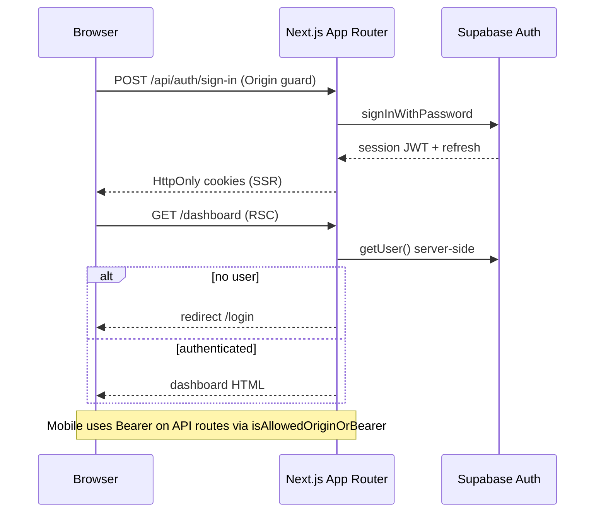
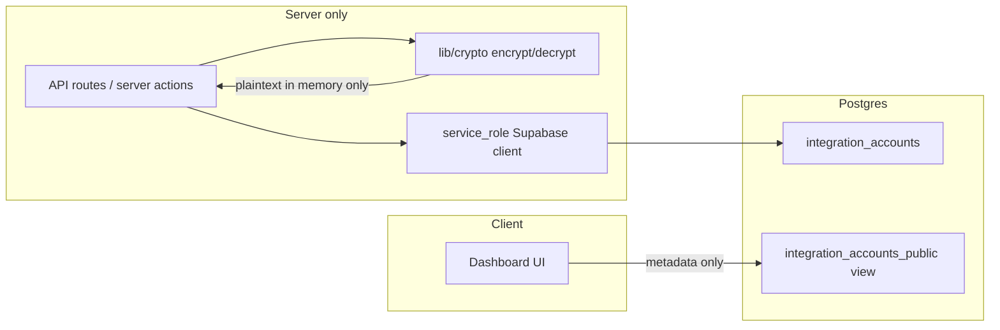

# Security data flow

High-level view of authentication, integration secrets, and privileged server access.

## Auth flow (cookie + Bearer)

## Integration token boundary

- Ciphertext columns are revoked from `authenticated` role.
- UI shows masked placeholders (`••••last4`).
- Re-encryption maintenance: `scripts/reencrypt-integration-tokens.mjs`.

## service_role usage map

| Area | Path |
|------|------|
| Integration sync | `lib/integrations/*`, cron routes |
| Bruno tool execution | `app/api/bruno/*`, `lib/bruno/*` |
| Account deletion | `dashboard/settings/danger/actions.ts` |
| Security audit log | `lib/security-audit.ts` |
| AI quota admin RPC | `lib/auth/rateLimit.ts` |
| Data retention cron | `app/api/cron/data-retention` |

Never expose `SUPABASE_SERVICE_ROLE_KEY` to the browser or `NEXT_PUBLIC_*` env vars.

## References

- [SECURITY.md](../../SECURITY.md)
- [ADR-004](../adr/004-integration-token-encryption.md)
- [SECRET_ROTATION.md](../SECRET_ROTATION.md)
