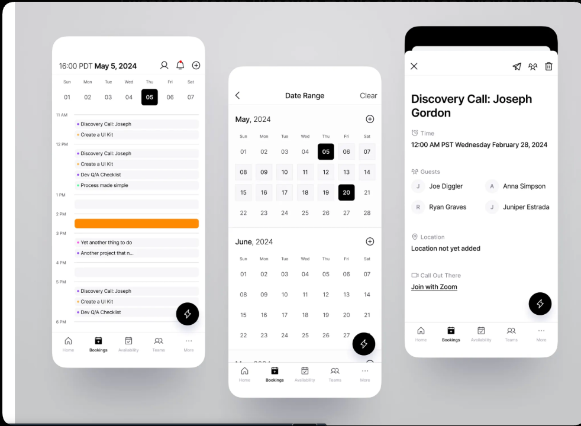
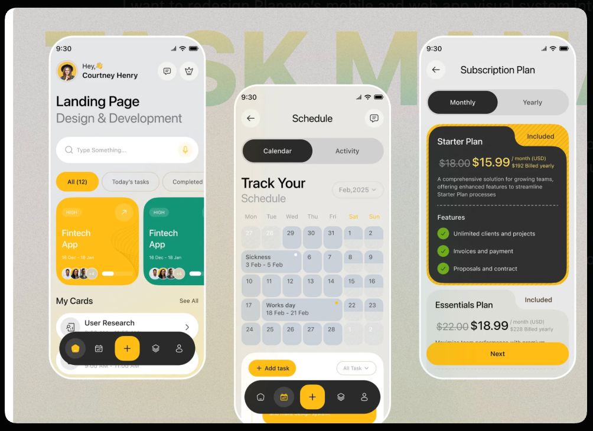
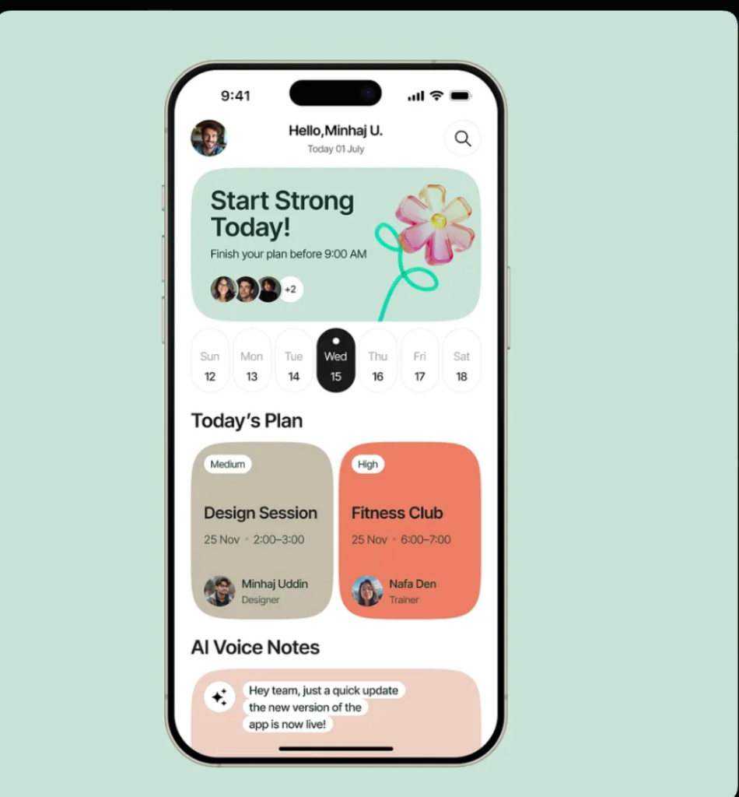
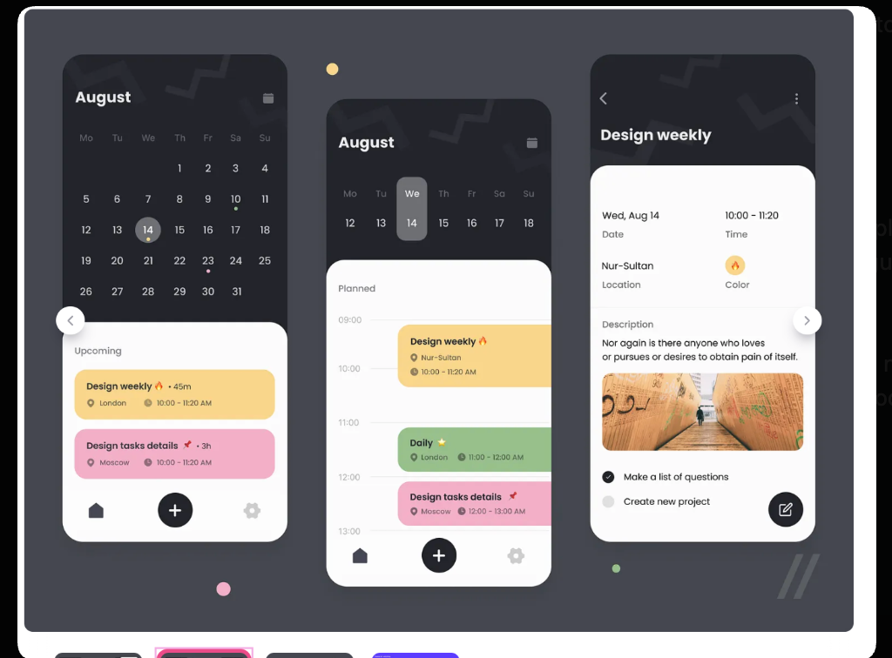
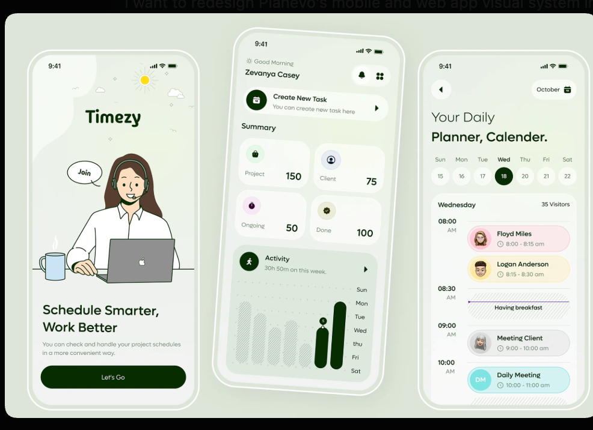
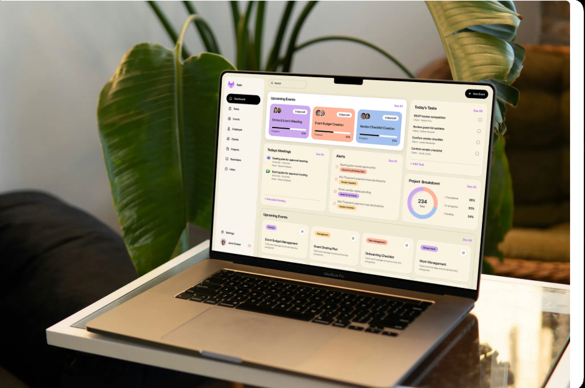

# Planevo V3 — Comprehensive Ecosystem Redesign Master Plan

> **Status:** PLANNING/DISCOVERY  
> **Positioning guardrails (2026-06):** Day + availability first; quiet automation; **Adaptive Day Rollover**; no AI-first or shame-free marketing; Goals/Habits vaulted. See [`apps/web/STRATEGY.md`](../../apps/web/STRATEGY.md).

> **Created:** 2026-06-15  
> **Owner:** Planevo Design System Team  
> **Scope:** Web App · Mobile App (iOS/Android) · Landing Page  
> **Goal:** Unified cross-platform identity where web and mobile look, feel, and act as one product  

---

## Table of Contents

1. [Design Philosophy & Brand DNA](#1-design-philosophy--brand-dna)
2. [Reference Image Structural Analysis](#2-reference-image-structural-analysis)
3. [Competitive Benchmark Study](#3-competitive-benchmark-study)
4. [Unified Design System Specification](#4-unified-design-system-specification)
5. [Liquid Glass Integration Strategy](#5-liquid-glass-integration-strategy)
6. [Platform-Specific Implementation Plans](#6-platform-specific-implementation-plans)
7. [Skill Integration Map](#7-skill-integration-map)
8. [Security & Accessibility Mandates](#8-security--accessibility-mandates)
9. [Phase Execution Timeline](#9-phase-execution-timeline)
10. [Verification & QA Strategy](#10-verification--qa-strategy)

---

## 1. Design Philosophy & Brand DNA

### Core Identity: "Quiet Competence"

Planevo's redesign follows a philosophy we call **Quiet Competence** — the interface whispers capability rather than shouting features. Bruno (the AI bear companion) is the emotional anchor; the UI itself is the structural anchor.

**Design Pillars:**

| Pillar | Meaning | Anti-Pattern |
|--------|---------|-------------|
| **Warmth over Chrome** | Organic colors (honey, cream, sage) feel human, not clinical | Cold grays, electric blues, neon accents |
| **Structured Calm** | Clear hierarchy through spacing and grouping, not borders and dividers | Visual noise, excessive borders, competing elements |
| **Adaptive Grace** | The plan bends — the UI should feel like it bends too (liquid glass, spring animations) | Rigid grids, abrupt transitions, static states |
| **Platform Respect** | Web feels like web. iOS feels like iOS. But both feel like Planevo. | Copy-paste web UI into mobile or vice versa |
| **Human-Crafted Quality** | Every pixel should feel intentional — no AI template tropes | Default shadows, generic card layouts, placeholder content |

### Brand Color System (Evolved)

The existing warm palette (cream, honey, sage, bruno) is Planevo's strongest asset. We **preserve** it but introduce a structural layer:

```
PRIMARY SURFACE:    Cream (#FBF6EA) → Paper foundation
SECONDARY SURFACE:  Cream-2 (#E8DCC0) → Card / raised surface
DARK SURFACE:       Ink (#1A140D) → Hero cards, dark sections
ACCENT PRIMARY:     Honey (#D08741) → CTAs, progress, active state
ACCENT SECONDARY:   Sage (#6B8B69) → Success, sync, positive
ACCENT TERTIARY:    Rose (#C56B5E) → Urgency, Canvas source, warnings
BRAND IDENTITY:     Bruno (#8B5A2B) → Character elements, personality
GLASS TINT:         rgba(251, 246, 234, 0.65) → Liquid glass overlay on iOS 26
```

---

## 2. Reference Image Structural Analysis

Each reference image was analyzed for layout, grid, spacing, color, component patterns, and motion cues. The insights below are extracted as **actionable constraints** that Planevo's redesign must respect.

---

### Reference 1 — Cal.com Booking Interface (Clean Professional)



**Structural Analysis:**

| Attribute | Finding | Planevo Application |
|-----------|---------|-------------------|
| **Layout** | 3-panel progressive disclosure: Timeline → Calendar Picker → Event Detail | Dashboard should use progressive disclosure: Daily Plan → Calendar → Task Detail |
| **Grid** | Single-column per panel, full-height, no wasted space | Mobile screens should be single-column, edge-to-edge content |
| **Typography** | System sans-serif, bold date header, monospace-like time labels | Keep our `font-mono` for time labels, `font-serif` for headings — stronger hierarchy than Cal.com |
| **Spacing** | Tight 8px-12px internal padding, generous 16-24px section gaps | Adopt 8px base grid. Internal padding: 12-16px. Section gaps: 20-32px |
| **Color** | Near-monochrome (black/white/gray) with orange progress bar accent | Our honey accent serves the same role as their orange — use it more sparingly as a progress indicator, not decoration |
| **Navigation** | Bottom tab bar with icon + label, 5 tabs max | Mobile: 5 tabs max (Plan, Calendar, Tasks, Bruno, Settings) ✓ Already aligned |
| **Detail View** | Right panel has structured metadata (Time, Guests, Location) with clear section labels | Task detail sheet should follow this pattern: structured key-value pairs, not free-form text |
| **Motion** | Panel slides in from right; no excessive animation | Sheet presentations should slide up (iOS native) or fade-in (web). No bouncy or distracting transitions |

**Key Takeaway:** Cal.com achieves professionalism through **restraint**. Planevo should adopt their information density but wrap it in our warmer palette. Their bottom tab bar validates our 5-tab mobile navigation.

---

### Reference 2 — Task Manager with Calendar & Pricing (Yellow/Black)



**Structural Analysis:**

| Attribute | Finding | Planevo Application |
|-----------|---------|-------------------|
| **Layout** | Greeting header → Search → Filter pills → Task cards → Bottom action bar | Dashboard greeting pattern matches ours. Add filter pills for task views |
| **Grid** | 2-column card grid for task cards; full-width for calendar | Task cards: 2-column on tablet/web, single column on phone. Calendar always full-width |
| **Typography** | Bold sans-serif headings ("Landing Page"), friendly greeting with emoji | Our `font-serif` headings are more distinctive — keep. Add emoji support to Bruno greetings |
| **Color** | Black/yellow primary accent with green task cards | Yellow accent ≈ our Honey. Their green cards ≈ our Sage. Color-coded task sources are validated |
| **Component: Filter Pills** | Horizontal scrolling pills ("All (12)", "Today's tasks", "Completed") | **ADOPT:** Add filter pill row to Tasks view on both web and mobile |
| **Component: FAB** | Centered floating action button ("+") in dark capsule bottom bar | **ADAPT:** Our mobile bottom bar should have a prominent "+" capture button (Quick Capture) |
| **Component: Pricing Card** | Yellow-bordered card with "Included" badge, feature checkmarks, monthly/yearly toggle | Redesign our pricing section to match: bordered accent cards, clear toggle, feature list with checkmarks |
| **Calendar Layout** | Month grid with colored event spans (blue-gray ranges, pink markers) | Our calendar should use soft color spans for multi-day events rather than dots |
| **Spacing** | 16px edge margins, 12px card gaps, 8px internal padding | Consistent with our target 8px grid system |

**Key Takeaway:** This reference validates our warm color palette and proves that **yellow/honey as primary accent on a light surface** works for productivity apps. The filter pills and FAB patterns must be adopted.

---

### Reference 3 — "Start Strong Today" Planner (Mint/Warm)



**Structural Analysis:**

| Attribute | Finding | Planevo Application |
|-----------|---------|-------------------|
| **Layout** | Greeting → Motivational Hero Card → Day Picker Strip → Task Cards (2-col) → AI Section | **CRITICAL MATCH:** This is structurally identical to what Planevo should be. Adopt this exact flow |
| **Hero Card** | Frosted/glass-like card with motivational message, avatar row, decorative 3D element | **ADOPT:** "Bruno's Morning Brief" card replaces generic hero. Use glass treatment + Bruno illustration |
| **Day Picker Strip** | Horizontal 7-day strip with current day highlighted (filled circle) | **ADOPT:** Add this to both mobile and web daily plan view. Current: filled dark circle. Others: light rounded rectangles |
| **Task Cards** | 2-column layout, priority badges ("Medium", "High"), person avatars, time ranges | **ADAPT:** Our task cards should show priority (via color tint), time range, and source icon (Canvas/Calendar/Manual) |
| **Color Mapping** | Beige/tan = medium priority, coral/salmon = high priority, mint = background | Map to Planevo: Honey-soft = medium, Rose-soft = high, Sage-soft = low |
| **AI Section** | "AI Voice Notes" with sparkle icon and speech bubble | **ADAPT:** This becomes "Bruno's Notes" — AI insight cards shown as friendly speech bubbles |
| **Typography** | Mix of serif (headings) and sans-serif (body). Bold, confident headings | Already aligned with our font-serif + font-sans pairing |
| **Border Radius** | 20-28px for cards, 12px for pills/badges, full-round for day picker items | Standardize: Cards = 22px (current), Pills = 12px, Day items = full-round |

**Key Takeaway:** This is the **closest reference to Planevo's ideal mobile experience**. The motivational hero card, day picker strip, 2-column task cards, and AI section map 1:1 to our features. This should be the primary reference for mobile home screen.

---

### Reference 4 — Dark Calendar App (Dark Mode Excellence)



**Structural Analysis:**

| Attribute | Finding | Planevo Application |
|-----------|---------|-------------------|
| **Layout** | 3-panel: Month Overview → Day Timeline → Event Detail | Calendar view should support this progressive disclosure on web (sidebar month → main day view → detail sheet) |
| **Dark Mode** | Deep charcoal (#1A1A2E-ish) base, white cards floating on dark, colored event blocks | **ADOPT:** Our dark mode should use `--color-ink` base with `--color-paper` cards floating above. Event blocks use source colors (rose, blue, honey, sage) |
| **Event Blocks** | Rounded rectangles with 12px radius, left-aligned text, colored backgrounds (yellow, green, pink) | **ADOPT:** Calendar event blocks should be rounded rectangles with source-color backgrounds at 15-20% opacity |
| **Month Grid** | Compact 7-column grid, current day highlighted with filled circle, subtle dot indicators for events | **ADOPT:** Replace our current react-big-calendar month view styling to match this clean grid |
| **Day View** | Time labels on left (09:00, 10:00...), events as full-width blocks adjacent to time labels | Already our pattern — refine with better spacing and color-coded blocks |
| **Detail View** | White card with structured fields: Date, Time, Location, Color, Description, Subtasks | **ADOPT:** Event/task detail sheet should follow this structured metadata layout |
| **Navigation** | Dark bottom tab bar with 3 icons (Home, +, Settings), center "+" is primary action | Validates centered FAB. We have 5 tabs but "+" should be visually prominent |
| **Spacing** | 16px margins, 12px grid gaps, 8-12px internal padding in cards | Consistent with our 8px grid target |
| **Motion Cues** | Carousel dots between panels suggest swipe navigation | Mobile: Support swipe between Month/Week/Day views |

**Key Takeaway:** This is the **dark mode benchmark**. Our dark mode must achieve this level of floating-card-on-dark-surface elegance. The event color-coding and structured detail view patterns are directly applicable.

---

### Reference 5 — "Timezy" Schedule Manager (Green/Organic)



**Structural Analysis:**

| Attribute | Finding | Planevo Application |
|-----------|---------|-------------------|
| **Layout** | Onboarding → Summary Dashboard → Daily Planner | Validates our 3-surface architecture: Onboarding → Dashboard → Daily Plan |
| **Onboarding** | Full-bleed illustration, bold "Schedule Smarter" heading, single CTA button | **ADOPT:** Our onboarding should use Bruno illustration, bold serif heading, single honey CTA |
| **Summary Dashboard** | Greeting ("Good Morning"), stat grid (Project: 150, Client: 75, etc.), activity chart | **ADAPT:** Our dashboard stat row maps to this. Use the 2x2 stat grid layout with colored icons |
| **Activity Chart** | Horizontal bar chart showing daily activity over the week (Sun-Sat) | **ADOPT:** Add a weekly activity mini-chart to the dashboard. Shows focus time per day |
| **Daily Planner** | Day picker strip + timeline view with colored event blocks and avatar badges | Confirms the day picker strip + timeline pattern from Reference 3 |
| **Color** | Monochrome green palette (dark green, sage, mint, cream) with warm accents | Our sage/cream palette is already aligned. Green = success/sync. Validates our color system |
| **Typography** | "Your Daily Planner, Calendar." — mix of script and sans-serif | We use serif for emotional headings. Keep but ensure it reads as premium, not whimsical |
| **Component: Create Task CTA** | Prominent "Create New Task" bar at the top of dashboard with arrow chevron | **ADAPT:** Add a quick-capture prompt at the top of the dashboard (below greeting) |
| **Stat Cards** | Icon-left, number-right layout with muted labels | **ADOPT:** Refine our Stat component to use icon + number + label in a cleaner layout |
| **Event Blocks** | Colored blocks with avatar, name, and time range. Colors = pink, green, purple | Validates our source-color event blocks. Add subtle avatar/icon to event blocks |

**Key Takeaway:** Timezy validates Planevo's **warm organic palette** and confirms that a green/sage color system works for productivity. Their dashboard summary pattern is the closest to our current implementation — we should refine, not replace.

---

### Reference 6 — Premium Web Dashboard Layout (MacBook Mockup)



**Structural Analysis:**

| Attribute | Finding | Planevo Application |
|-----------|---------|-------------------|
| **Layout** | 3-column content grid: Left Column (Meetings + Bottom Grid) / Middle Column (Upcoming Events + Alerts + Bottom Grid) / Right Column (Tasks + Project Donut) | **ADOPT:** Desktop web dashboard layout structure. Group widgets into high, medium, and low urgency zones. |
| **Sidebar** | Light cream/beige sidebar with dark active capsule pill ("Dashboard") and colored icons | **ADAPT:** Web app navigation uses cream sidebar, dark ink capsule with white text for active tab, and colored icons matching tab category. |
| **Cards** | Soft paper-white surfaces (`#FFFFFF` or light ivory) with thin subtle borders and very light drop shadows | **ADOPT:** Standardize web card component style — no heavy border, very light border, and soft elevated shadows. |
| **Progress Indicators** | Horizontal bar sliders with category-specific colors (purple, peach, blue) and "X Days Left" pill badges | **ADOPT:** Goal cards and project tracking use soft colored horizontal bars with percentage and time-remaining badges. |
| **Alerts Section** | Grouped vertical feed with soft warning pills ("Home For All Charity Gala") and circular icon indicator | **ADOPT:** Dashboard notification center matches this vertical stream layout with clear context tags. |
| **Breakdown Donut** | Clear circular data visualization showing distribution of items (Completed, In Progress, Pending) | **ADOPT:** Weekly stats or task distribution donut chart widget in the right sidebar. |
| **Card Grid Footer** | Row of 4 uniform feature/category cards with directional arrows, soft category pills, and description | **ADOPT:** Feature links or quick workspace shortcuts at the bottom of the dashboard page. |
| **Spacing & Radius** | Rounded corners (16-22px), spacious margins (24px) creating clean separation and calm breathing room | **ADOPT:** RADIUS-LG (16px) for widgets and RADIUS-XL (22px) for main layouts. Spacing-6 (24px) for section grids. |

**Key Takeaway:** This is the **primary reference for Planevo's web app layout**. It achieves a state-of-the-art, premium look through warm tone surfaces, high-contrast capsule buttons, category-specific soft color tags, and a balanced three-column information hierarchy.

---

## 3. Competitive Benchmark Study

### How Best-in-Class Apps Achieve Cross-Platform Unity

| Company | Strategy | Web Feel | Mobile Feel | What Planevo Should Learn |
|---------|----------|----------|-------------|--------------------------|
| **Notion** | Identical component library, same layout density on both platforms | Desktop app in a browser | Desktop app on a phone (sometimes too dense) | Share design tokens but **adapt density** — mobile should breathe more |
| **Todoist** | Shared brand identity, platform-native patterns per surface | Clean web app, sidebar + content | Native-feeling iOS/Android with system navigation | **Best model for Planevo.** Same brand, different platform expression |
| **Linear** | Opinionated design system, keyboard-first on web, gesture-first on mobile | Power-user desktop tool | Streamlined mobile companion | Share the **data model and brand** but let each platform play to its strengths |
| **Things 3** | iOS-first, web is secondary (no web app) | N/A | Gold standard iOS design | Copy their **attention to detail** in iOS animations, haptics, typography |
| **Apple Reminders** | Platform-native everything, uses system components | iCloud.com basic interface | Full native SwiftUI | Use **native SwiftUI components** on iOS where possible (Liquid Glass tab bar, sheets, haptics) |

### The Planevo Principle

> **Same brand. Same data. Same warmth. Platform-native expression.**

This means:
- **Shared:** Color tokens, typography scale, icon set, spacing grid, component names
- **Different:** Layout density, navigation patterns, interaction models, animation curves
- **Web:** Sidebar navigation, wider content areas, hover states, keyboard shortcuts
- **Mobile:** Tab bar navigation, gesture-driven, compact cards, haptic feedback, Liquid Glass

---

## 4. Unified Design System Specification

### 4.1 Typography Scale

All platforms share the same type scale, adjusted for viewport:

```
DISPLAY:     font-serif   48/56/64/84px   (landing hero only)
H1:          font-serif   32/40/48px      (page title)
H2:          font-serif   24/28/32px      (section title)  
H3:          font-sans    18/20/22px      (card title)
BODY:        font-sans    14/15/16px      (default text)
SMALL:       font-sans    12/13px         (secondary text)
CAPTION:     font-mono    9/10/11px       (timestamps, labels, tracking-widest)
```

**Font Pairing:**
- Web: `Inter` (sans) + `Instrument Serif` or `Source Serif 4` (serif) + `JetBrains Mono` (mono)
- iOS: `SF Pro` (sans, system) + custom serif registered as secondary + `SF Mono` (mono)

**Rules:**
- Headings always use `font-serif` for warmth
- Time labels, badges, status indicators always use `font-mono` with `tracking-widest` + `uppercase`
- Body text always uses `font-sans`
- Never mix weights within a single line

### 4.2 Spacing System (8px Grid)

```
SPACE-1:   4px    (icon-text gap, tight internal)
SPACE-2:   8px    (card internal padding minimum)
SPACE-3:   12px   (card gap, pill padding)
SPACE-4:   16px   (section padding, edge margins on mobile)
SPACE-5:   20px   (section gap small)
SPACE-6:   24px   (section gap medium)
SPACE-8:   32px   (section gap large)
SPACE-10:  40px   (page section dividers)
SPACE-12:  48px   (major section breaks)
SPACE-16:  64px   (landing page section gaps)
```

### 4.3 Border Radius Token System

```
RADIUS-SM:    8px     (input fields, small buttons)
RADIUS-MD:    12px    (pills, badges, filter chips)
RADIUS-LG:    16px    (inner cards, dialogs)
RADIUS-XL:    22px    (primary cards, stat cards)
RADIUS-2XL:   32px    (hero cards, landing sections)
RADIUS-3XL:   40px    (landing hero container)
RADIUS-FULL:  9999px  (avatars, FAB, pill buttons)
```

### 4.4 Shadow System

```
SHADOW-SM:    0 1px 2px rgba(26,20,13,0.05)              — subtle lift
SHADOW-MD:    0 4px 12px rgba(26,20,13,0.08)             — card default
SHADOW-LG:    0 8px 24px rgba(26,20,13,0.12)             — floating elements
SHADOW-XL:    0 16px 48px rgba(26,20,13,0.16)            — modals, sheets
SHADOW-GLOW:  0 0 32px rgba(208,135,65,0.15)             — honey glow on hover
```

### 4.5 Component Vocabulary (Shared Names)

| Component | Web Implementation | Mobile Implementation |
|-----------|-------------------|----------------------|
| `DayPickerStrip` | Horizontal scrollable div with 7-day items | `ScrollView` horizontal with `Pressable` items |
| `TaskCard` | CSS grid card with source color tint | `View` with `StyleSheet` and source color |
| `StatTile` | CSS grid cell with icon + metric + label | `View` with flexbox layout |
| `FilterPills` | Horizontal flex with overflow-x scroll | `FlatList` horizontal with snap behavior |
| `BrunoCard` | Glass-treated card with Bruno avatar + message | `BlurView` card with Bruno avatar + message |
| `EventBlock` | Timeline-positioned div with source color bg | Timeline-positioned `View` with source color |
| `QuickCapture` | Modal with text input and source selector | Bottom sheet with text input and source selector |
| `ProgressRing` | SVG circle with animated stroke-dashoffset | React Native SVG circle with animated offset |
| `GlassSheet` | `backdrop-filter: blur(20px)` dialog | `expo-glass-effect` or `UIBlurEffect` sheet |

---

## 5. Liquid Glass Integration Strategy

### Source: `devanshuDesai/agent-skills` → `expo-liquid-glass` Skill

### Core Principles from Apple HIG

1. **Glass is for chrome, not content.** Use on navigation bars, tab bars, FABs, floating action clusters — never on primary content cards.
2. **One dominant glass layer per region.** Don't stack blur effects.
3. **Content edge-to-edge behind glass.** Glass needs visual variety from background content to be effective.
4. **Brand color goes in content, not glass.** Glass should be neutral; our honey/sage colors live in the content below.
5. **Verify in all appearances:** light, dark, clear, tinted.

### Implementation Paths

| Path | Platform | Where Used |
|------|----------|-----------|
| `expo-glass-effect` | iOS (Expo) | Floating Bruno chat FAB, Quick Capture button, action clusters |
| `@expo/ui` SwiftUI bridge | iOS (Expo) | Tab bar glass treatment (iOS 26), navigation bar glass |
| `expo-router/unstable-native-tabs` | iOS (Expo) | System Liquid Glass tab bar on iOS 26 |
| CSS `backdrop-filter: blur()` | Web | Sidebar glass treatment, modal overlays, floating nav |

### Web Liquid Glass CSS Recipe

```css
.glass-surface {
  background: rgba(251, 246, 234, 0.65);  /* cream at 65% */
  backdrop-filter: blur(20px) saturate(1.4);
  -webkit-backdrop-filter: blur(20px) saturate(1.4);
  border: 1px solid rgba(26, 20, 13, 0.08);
  box-shadow: 
    0 4px 12px rgba(26, 20, 13, 0.06),
    inset 0 1px 0 rgba(255, 255, 255, 0.4);
}

/* Dark mode variant */
html.dark .glass-surface {
  background: rgba(18, 18, 20, 0.7);
  border-color: rgba(250, 250, 250, 0.08);
  box-shadow:
    0 4px 12px rgba(0, 0, 0, 0.3),
    inset 0 1px 0 rgba(255, 255, 255, 0.05);
}
```

### Fallback Strategy

- **iOS < 26:** Standard solid background matching `--color-cream` or `--color-paper`
- **Android:** Solid background — no blur effects (performance concern)
- **Web (no backdrop-filter support):** Solid background with slight transparency
- **prefers-reduced-transparency:** Solid opaque surface

---

## 6. Platform-Specific Implementation Plans

---

### 6A. Web App Redesign

**Tech Stack:** Next.js 15+ App Router · React 19 · Tailwind CSS v4 · Framer Motion

#### 6A.1 Dashboard Redesign

**Current State:** Functional but visually dense. Greeting + hero card + stat row + detail row.

**Target State (Reference 6 — Primary Web Benchmark):**

```
┌────────────────────────────────────────────────────────────────────────────────────────────────┐
│  [SIDEBAR]         │  [TOP BAR]  🔍 Search                                       [+ New Event] │
│                    ├───────────────────────────────────────────────────────────────────────────┤
│  Dashboard (Active)│                                                                           │
│  Tasks             │  ┌── UPCOMING EVENTS (Row/Carousel) ───────────────────────────────────┐  │
│  Events            │  │ ┌───────────────┐ ┌───────────────┐ ┌───────────────┐               │  │
│  Employee          │  │ │ Emma & Liam   │ │ Budget        │ │ Vendor Check  │               │  │
│  Clients           │  │ │ 📅 3 Days Left│ │ 📅 3 Days Left│ │ 📅 2 Days Left│               │  │
│  Projects          │  │ │ ■■■■■■■■░ 85% │ │ ■■■■■■■■░ 85% │ │ ■■■■■░░░░ 62% │               │  │
│  Reminders         │  │ └───────────────┘ └───────────────┘ └───────────────┘               │  │
│  Inbox             │  └─────────────────────────────────────────────────────────────────────┘  │
│                    │                                                                           │
│                    │  ┌── TODAY'S MEETINGS ──────────────┐  ┌── ALERTS ─────────────────────┐  │
│  Settings          │  │ ◉ Seating plan for approval      │  │ ⚠️ Seating plan needs approval│  │
│  👤 Jane Cooper    │  │   10:00 AM - 10:30 AM · Bessie   │  │    for Charity Gala           │  │
│                    │  │                                  │  │ ⚠️ Payment declined: Mia T.   │  │
│                    │  │ ◉ Seating plan for approval      │  │ ⚠️ Photo reply pending        │  │
│                    │  │   10:00 AM - 10:30 AM · Bessie   │  │ ⚠️ Payment declined: Mia T.   │  │
│                    │  │                                  │  │                               │  │
│                    │  │ [+ Schedule Meeting]             │  └───────────────────────────────┘  │
│                    │  └──────────────────────────────────┘                                     │
│                    │                                                                           │
│                    │  ┌── WORKSPACES (Grid Footer) ─────────────────────────────────────────┐  │
│                    │  │ ┌──────────────────────┐ ┌──────────────────────┐                   │  │
│                    │  │ │ Finance              │ │ Management           │                   │  │
│                    │  │ │ Budget Management   │ │ Guest Seating Plan   │                   │  │
│                    │  │ └──────────────────────┘ └──────────────────────┘                   │  │
│                    │  └─────────────────────────────────────────────────────────────────────┘  │
└────────────────────┴───────────────────────────────────────────────────────────────────────────┘
```

**Right-hand widgets in layout (flex/grid):**
- **Today's Tasks** list card on right sidebar:
  - "RSVP tracker completion" (Client: Robert Fox)
  - "Review guest list updates" (Client: Esther Howard)
  - "Confirm vendor checklist" (Client: Leslie Alexander)
  - "Confirm vendor checklist" (Client: Jacob Jones)
  - "+ Add Task" button.
- **Project Breakdown** donut chart card on right sidebar:
  - Donut showing Completed (30%), In Progress (36%), Pending (34%).
  - Total: 234 tasks.

**Changes from Current:**
1. **Layout Structure:** Shift from single-column vertical stack to a responsive 3-column workspace grid matching Reference 6.
2. **Sidebar Aesthetics:** Light cream/beige base styling. Active items styled as a dark capsule pill (`--color-ink`) with white text and category-themed icons.
3. **Information Grouping:**
   - **Column 1 (Focus/Planning):** Meetings, Calendar events, and Workspace project folders.
   - **Column 2 (Urgency/Activity):** Upcoming events with colored progress bars + live Alerts/Notifications feed.
   - **Column 3 (Execution/Stats):** Today's checkable Tasks list + Project Breakdown donut chart.
4. **Card Styling:** Rounded corners of 16-22px (RADIUS-LG/RADIUS-XL), soft white backgrounds (`--color-paper`), very thin borders, and soft shadows (SHADOW-SM/SHADOW-MD).
5. **Interactive Header:** Add a global Search bar and prominent capsule shaped "+ New Event" CTA button on the dashboard header.

#### 6A.2 Calendar View Redesign

**Target (Reference 4 month grid + Reference 1 timeline):**
- Month view: Clean 7-column grid with event dot indicators
- Week view: Time-labeled timeline with color-coded event blocks
- Day view: Detailed timeline with expandable event cards
- Event blocks: Rounded rectangles with source-color bg at 15% opacity

#### 6A.3 Tasks View Redesign

**Target (Reference 2 filter pills + Reference 3 card grid):**
- Add `FilterPills` row: All · Today · Overdue · Completed · By Source
- Task cards: 2-column grid on desktop, single column on mobile
- Each card: Title, due date, source icon + color tint, priority badge
- Swipe-to-complete on mobile; checkbox on web

#### 6A.4 Settings View

- Preserve current structure (working well)
- Add Liquid Glass header treatment
- Ensure all form inputs follow `/frontend-security-coder` validation patterns

#### 6A.5 Sidebar Redesign

**Current:** Solid `--color-ink` background
**Target:** Glass-treated sidebar on light mode, solid dark on dark mode
- Glass treatment uses `backdrop-filter: blur(20px)`
- Active nav item: honey accent pill
- Collapsed state: icons only with tooltip on hover

---

### 6B. Mobile App Redesign (Expo / React Native)

**Tech Stack:** Expo SDK 54+ · React Native · expo-glass-effect · expo-router

#### 6B.1 Home Tab (Plan) Redesign

**Target (Reference 3 — primary reference):**

```
┌─────────────────────────────────┐
│ 9:41                    ▼ ≡     │
│                                 │
│ 👤 Hello, Jordan.               │
│    Friday, Jun 15               │
│                                 │
│ ┌─────────────────────────────┐ │
│ │ 🐻  Start Strong Today!     │ │
│ │     Focus on Calc PS8 first │ │
│ │     before your lab at 11.  │ │
│ │                    🌸        │ │
│ └─────────────────────────────┘ │
│                                 │
│ Sun Mon Tue ●Wed Thu Fri Sat    │
│  12  13  14  15  16  17  18    │
│                                 │
│ Today's Plan                    │
│ ┌──────────┐  ┌──────────┐     │
│ │ ■ Medium │  │ ■ High   │     │
│ │          │  │          │     │
│ │ Calc PS8 │  │ Bio Lab  │     │
│ │ 9:00-    │  │ 11:00-   │     │
│ │ 10:30    │  │ 12:00    │     │
│ │ 📕Canvas │  │ 📅Cal    │     │
│ └──────────┘  └──────────┘     │
│                                 │
│ Bruno's Notes                   │
│ ┌─────────────────────────────┐ │
│ │ ✨ Your essay moved to tmrw │ │
│ │    — you write better in    │ │
│ │    the morning.             │ │
│ └─────────────────────────────┘ │
│                                 │
│ ⌂    📅    ＋    💬    ⚙      │
│ Plan Cal        Bruno Settings │
└─────────────────────────────────┘
```

#### 6B.2 Tab Bar Redesign

**Current:** Standard Expo tab bar with solid background
**Target:**
- **iOS 26+:** Use `expo-router/unstable-native-tabs` for system Liquid Glass tab bar
- **iOS < 26:** Standard tab bar with blur background (`UIBlurEffect`)
- **Android:** Solid surface tab bar matching `--color-paper`

```tsx
// iOS 26 Liquid Glass tab bar (conceptual)
import { Tabs } from 'expo-router/unstable-native-tabs';

<Tabs>
  <Tabs.Screen name="index" options={{ title: 'Plan', tabBarIcon: PlanIcon }} />
  <Tabs.Screen name="calendar" options={{ title: 'Calendar', tabBarIcon: CalIcon }} />
  <Tabs.Screen name="tasks" options={{ title: 'Tasks', tabBarIcon: TasksIcon }} />
  <Tabs.Screen name="chat" options={{ title: 'Bruno', tabBarIcon: BrunoIcon }} />
  <Tabs.Screen name="settings" options={{ title: 'Settings', tabBarIcon: SettingsIcon }} />
</Tabs>
```

#### 6B.3 Calendar Tab

- Day picker strip at top (same component as home)
- Timeline view below with color-coded event blocks
- Month grid accessible via "expand" gesture
- Event detail: Bottom sheet (iOS) with structured metadata (Reference 1/4)

#### 6B.4 Tasks Tab

- Filter pills at top (Reference 2)
- Task list with swipe gestures (complete, snooze, delete)
- Priority color tints on cards
- Floating "+" capture button (Reference 2/4 FAB pattern)

#### 6B.5 Bruno Chat Tab

- Chat interface with Bruno avatar
- Glass-treated input bar at bottom
- AI response bubbles with honey tint
- Action cards inline (schedule changes, task moves)

#### 6B.6 Settings Tab

- Grouped sections with rounded containers
- Toggle switches for preferences
- Theme selector (light/dark/sepia) with live preview

---

### 6C. Landing Page Redesign

**Current State:** Functional but has "false claims" and doesn't match the app's actual quality.

**Target State:** Premium, honest, conversion-optimized page that looks like it belongs to the same product as the app.

#### 6C.1 Structure

```
1. HERO — "Plans that bend. Never break." (keep, refine)
2. DEMO — Interactive daily plan simulation (keep, enhance with glass treatment)
3. SOCIAL PROOF — Real user quotes (ADD — currently missing)
4. THREE MOVES — Connect / Plan / Ask Bruno (keep, refine cards)
5. BRUNO LETTER — adaptive day recovery tone (e.g. "When the day falls apart, we rebuild around what's left") — see design handoff
6. COMPARISON — Planevo vs. traditional planners (ADD)
7. PRICING — Single tier (keep, redesign card per Reference 2)
8. FAQ — Common questions (ADD)
9. FINAL CTA — "Let Bruno plan it." (keep)
```

#### 6C.2 What to Fix

| Issue | Fix |
|-------|-----|
| "False claims" (user feedback) | Remove any unverifiable stats. Replace with honest messaging about beta status |
| No social proof | Add 3-5 real testimonials with photos or integrate beta user count |
| Pricing card is generic | Redesign per Reference 2: accent-bordered card, feature checkmarks, .edu badge |
| No FAQ | Add 6-8 common questions in accordion |
| No comparison | Add "Planevo vs. Other Planners" visual comparison table |
| Hero demo doesn't match app | Update hero simulation to match the actual dashboard design post-redesign |
| No mobile app store badges | Add "Download on App Store" and "Get it on Google Play" badges |

#### 6C.3 Landing Page Scroll Animations

Using `/modern-web-guidance` and `/scroll-experience` skill patterns:

- **Scroll-driven animations** for section reveals (CSS `animation-timeline: scroll()`)
- **View Transitions API** for page-level transitions
- **IntersectionObserver** for lazy-loading sections
- **Framer Motion** `whileInView` for card entrances (already implemented, keep)
- **No parallax** on mobile (performance concern)

---

## 7. Skill Integration Map

Each skill is mapped to specific implementation tasks across all three platforms:

---

### `/frontend-developer` (React 19 + Next.js 15)

**Applied To:**
- Dashboard component architecture (Server Components for data, Client Components for interactivity)
- `DayPickerStrip`, `FilterPills`, `TaskCard`, `StatTile` component development
- State management with `useUIStore` (Zustand) for sidebar, theme, and filter state
- `useCalendarEvents` hook refinement for real-time updates
- Server Actions for form submissions (settings, quick capture)

**Rules Enforced:**
- All data fetching via Server Components or `use()` hook
- Client-side state only for UI state (sidebar collapsed, active filter, selected date)
- No `useEffect` for data fetching — use React Query or Server Components
- Suspense boundaries with skeleton fallbacks for every async section

---

### `/frontend-design` (Design-Engineer Mandates)

**Applied To:**
- **DFII Score Target:** 8.5+ (Design Fidelity & Implementation Integrity)
- Visual QA of every component against reference images
- Ensuring "human-crafted" quality — no default shadows, no generic card layouts
- Color temperature consistency across light/dark/sepia modes
- Animation timing curves: prefer `cubic-bezier(0.34, 1.56, 0.64, 1)` for spring, `ease-out` for reveals

**Rules Enforced:**
- Every component must pass visual regression testing
- No component ships without dark mode and reduced-motion variants
- Typography hierarchy must be testable: if you remove color, can you still read the hierarchy?

---

### `/frontend-security-coder` (XSS Prevention + CSP)

**Applied To:**
- All form inputs on landing page (email capture), auth pages, settings, quick capture
- Bruno chat message rendering (user input → display)
- Calendar event titles/descriptions from external sources (Google Calendar, Canvas)
- CSP headers via `next.config.ts` and `middleware.ts`

**Rules Enforced:**
- **NEVER use `innerHTML` or `dangerouslySetInnerHTML` without DOMPurify**
- All user input rendered via `textContent` or React's built-in escaping
- Bruno chat markdown rendering uses `react-markdown` with explicit allow-list (no raw HTML)
- CSP header: `script-src 'self'; style-src 'self' 'unsafe-inline'; img-src 'self' data: https:`
- All external links: `rel="noopener noreferrer"` + `target="_blank"`
- Input validation: max lengths on all text fields, URL validation on link inputs
- Form submissions: CSRF token validation via Supabase session

---

### `/ui-ux-pro-max` (UX Patterns + Accessibility)

**Applied To:**
- Touch target sizes: minimum 44×44px on mobile (Apple HIG), 32×32px on web
- Color contrast: WCAG AA minimum (4.5:1 for body text, 3:1 for large text)
- Focus management: visible focus rings on all interactive elements
- Screen reader support: all icons have `aria-label`, all images have `alt`
- Loading states: skeleton screens (not spinners) for all async content
- Error states: inline error messages near the failed input, not toast-only
- Empty states: Bruno character illustration + helpful message + action CTA

**Specific Fixes:**
- Calendar: keyboard navigation for date selection
- Task cards: focus-visible outline matches card radius
- Settings: form labels associated with inputs via `htmlFor`/`id`
- Mobile: `accessibilityRole` on all touchable elements

---

### `/ios-developer` (SwiftUI + iOS 18)

**Applied To:**
- Tab bar: Liquid Glass treatment on iOS 26+
- Sheets: Native iOS sheet presentation with detents
- Haptics: `UIImpactFeedbackGenerator` on task completion, schedule refresh
- Typography: SF Pro system font integration via `expo-font`
- Safe area handling: proper `useSafeAreaInsets()` on all screens
- Keyboard avoidance: `KeyboardAvoidingView` on chat and capture screens

**Architecture:**
- MVVM pattern where ViewModels are Zustand stores
- Navigation via expo-router file-based routing
- Platform checks: `Platform.OS === 'ios' && parseInt(Platform.Version) >= 26`

---

### `/modern-web-guidance` (CSS + Performance APIs)

**Applied To:**
- `backdrop-filter` for glass effects (with fallback detection)
- `scroll-timeline` for landing page animations
- `content-visibility: auto` for off-screen calendar rows
- `fetchpriority="high"` on hero images and Bruno SVG
- Container queries for responsive card layouts
- CSS `@layer` for design system token organization
- `prefers-reduced-motion` media query for all animations
- `prefers-color-scheme` for automatic theme detection

**Performance Targets:**
- LCP < 2.5s on landing page
- INP < 200ms on dashboard interactions
- CLS < 0.1 across all pages

---

### `/top-web-vulnerabilities` (Security Audit Checklist)

**Applied To:**
- Auth pages (login, signup, forgot-password, reset-password)
- API routes (`/api/ai/*`, `/api/integrations/*`)
- Form submissions (settings, quick capture, chat messages)
- File uploads (future: avatar, attachments)

**Specific Checks:**
1. **XSS (A03):** All user-generated content sanitized before render
2. **CSRF (A01):** Supabase session tokens validate all mutations
3. **Injection (A03):** Parameterized queries via Supabase SDK (never raw SQL)
4. **Broken Auth (A07):** Session timeout, re-authentication for sensitive operations
5. **Security Misconfiguration (A05):** No debug info in production, proper CORS headers
6. **SSRF (A10):** Canvas/Google API calls validate URLs against allow-list

---

### `/canvas-design` (Design Philosophy Expression)

**Applied To:**
- Landing page visual identity and aesthetic cohesion
- Bruno character consistency across all surfaces
- Color temperature and material quality of glass effects
- The "feeling" of the app — calm, warm, competent

**Aesthetic Movement: "Organic Precision"**

> The intersection of natural warmth and computational accuracy. Like a hand-drawn plan on graph paper. Like a bear who knows calculus.

**Expressed Through:**
- Serif typography for emotional headings (organic)
- Monospace for timestamps and data (precision)
- Rounded corners but consistent radii (organic precision)
- Honey/cream palette (organic) with strict 8px grid (precision)
- Bruno's character: a bear (organic) who manages your schedule (precision)

---

## 8. Security & Accessibility Mandates

### Non-Negotiable Security Requirements

| Requirement | Implementation | Verification |
|-------------|---------------|-------------|
| No `innerHTML` | Use `textContent`, React JSX, or DOMPurify | ESLint rule: `no-inner-html` |
| CSP headers | `next.config.ts` security headers | Lighthouse security audit |
| Input sanitization | Server-side validation on all API routes | Unit tests on API routes |
| Auth token handling | HTTP-only cookies via Supabase | No tokens in localStorage |
| External link safety | `rel="noopener noreferrer"` on all external links | Automated link checker |
| Dependency audit | `npm audit` in CI pipeline | Zero high/critical vulnerabilities |

### Non-Negotiable Accessibility Requirements

| Requirement | Standard | Verification |
|-------------|----------|-------------|
| Color contrast | WCAG AA (4.5:1 body, 3:1 large) | axe-core automated testing |
| Touch targets | 44×44px minimum (iOS), 48×48dp (Android) | Manual measurement |
| Focus visible | 2px outline on all interactive elements | Keyboard-only navigation test |
| Screen reader | All content accessible via VoiceOver/TalkBack | Manual testing with AT |
| Reduced motion | All animations respect `prefers-reduced-motion` | Toggle system preference and verify |
| Semantic HTML | Proper heading hierarchy, landmark regions | HTML validator + axe-core |

---

## 9. Phase Execution Timeline

### Phase 1: Design System Foundation (Week 1-2)

- [ ] Create unified design token file (`tokens.css` for web, `tokens.ts` for mobile)
- [ ] Build `DayPickerStrip` component (web + mobile)
- [ ] Build `FilterPills` component (web + mobile)
- [ ] Build `TaskCard` component with source-color tints (web + mobile)
- [ ] Build `StatTile` component with icon layout (web + mobile)
- [ ] Build `BrunoCard` glass-treated component (web + mobile)
- [ ] Build `GlassSheet` / `GlassSurface` component with fallbacks
- [ ] Set up visual regression testing (Playwright screenshots)

### Phase 2: Web App Redesign (Week 3-5)

- [ ] Redesign Dashboard page with new component library
- [ ] Redesign Calendar view with clean month grid + timeline
- [ ] Redesign Tasks view with filter pills + card grid
- [ ] Redesign Sidebar with glass treatment
- [ ] Add keyboard shortcuts (Cmd+K command palette)
- [ ] Dark mode polish pass
- [ ] Performance optimization (LCP, INP, CLS targets)
- [ ] Security audit (CSP headers, input sanitization)
- [ ] Accessibility audit (axe-core, keyboard nav, screen reader)

### Phase 3: Mobile App Redesign (Week 5-7)

- [ ] Redesign Home tab (Plan) with Bruno brief + day picker + task cards
- [ ] Redesign Calendar tab with day picker strip + timeline
- [ ] Redesign Tasks tab with filter pills + swipe gestures
- [ ] Redesign Bruno Chat tab with glass input bar
- [ ] Implement Liquid Glass tab bar (iOS 26+)
- [ ] Add haptic feedback on task completion + schedule refresh
- [ ] Platform-specific navigation polish (sheet presentations, gestures)
- [ ] Android compatibility pass (solid fallbacks, material transitions)

### Phase 4: Landing Page Redesign (Week 7-8)

- [ ] Rebuild hero section with updated simulation matching new dashboard
- [ ] Add social proof section with real testimonials
- [ ] Redesign pricing card per Reference 2 style
- [ ] Add FAQ accordion section
- [ ] Add comparison table (Planevo vs. others)
- [ ] Implement scroll-driven animations
- [ ] Remove false claims; add honest beta messaging
- [ ] Add app store download badges
- [ ] SEO optimization (meta tags, structured data, heading hierarchy)
- [ ] Performance optimization (LCP < 2.5s)

### Phase 5: Polish & QA (Week 8-9)

- [ ] Cross-platform visual consistency audit (screenshot comparison)
- [ ] Full security penetration test
- [ ] Full accessibility audit (automated + manual)
- [ ] Performance benchmarking against targets
- [ ] User testing with 3-5 beta users
- [ ] Bug fixes and refinements
- [ ] Documentation of design system for future development

---

## 10. Verification & QA Strategy

### Automated Testing

```bash
# Web — Visual regression
npx playwright test --project=chromium --update-snapshots

# Web — Accessibility
npx axe-core --reporter=html --output=accessibility-report.html

# Web — Lighthouse
npx lighthouse http://localhost:3000 --output=json --output-path=lighthouse-report.json

# Mobile — Component tests
npx jest --testPathPattern=components

# Security — Dependency audit
npm audit --production
```

### Manual Testing Checklist

- [ ] Open dashboard on Chrome, Safari, Firefox, Edge
- [ ] Open dashboard on iPhone 15 Pro (iOS 18), iPhone 16 (iOS 26 simulator)
- [ ] Open dashboard on Android 14 device
- [ ] Toggle light → dark → sepia on all platforms
- [ ] Navigate all routes with keyboard only
- [ ] Navigate all routes with VoiceOver / TalkBack
- [ ] Test with `prefers-reduced-motion: reduce`
- [ ] Test with `prefers-color-scheme: dark`
- [ ] Test all forms with SQL injection strings
- [ ] Test all text inputs with XSS payloads
- [ ] Verify no console errors in production build

---

## Appendix: Reference Image Index

| Ref # | File | Description | Primary Use |
|-------|------|-------------|-------------|
| 1 | `ref1-cal-booking.png` | Cal.com booking (timeline, calendar, detail) | Timeline layout, detail sheet structure |
| 2 | `ref2-task-manager-yellow.png` | Task manager (home, schedule, pricing) | Filter pills, FAB, pricing card, color system |
| 3 | `ref3-start-strong-planner.png` | "Start Strong" planner (hero, day picker, tasks) | **Primary mobile reference.** Hero card, day picker, 2-col tasks |
| 4 | `ref4-dark-calendar.png` | Dark calendar (month, day, detail) | **Dark mode benchmark.** Event blocks, detail sheet |
| 5 | `ref5-timezy-green.png` | Timezy (onboarding, dashboard, planner) | Stat grid, activity chart, organic color validation |
| 6 | `ref6-web-dashboard.png` | Premium web dashboard laptop mockup | **Primary web reference.** Three-column layout, sidebar, cards, progress widgets |

---

*This document is the single source of truth for Planevo V3 redesign. It should be referenced at the start of every implementation session and updated as decisions are made.*
